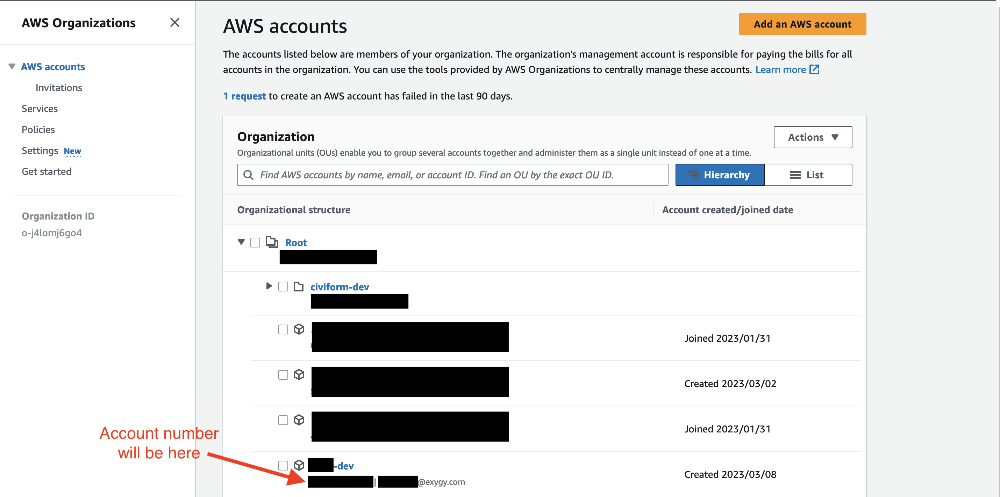
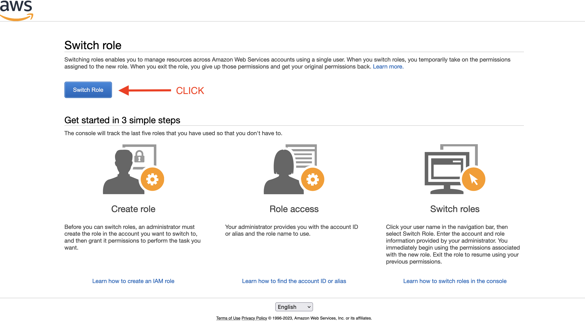
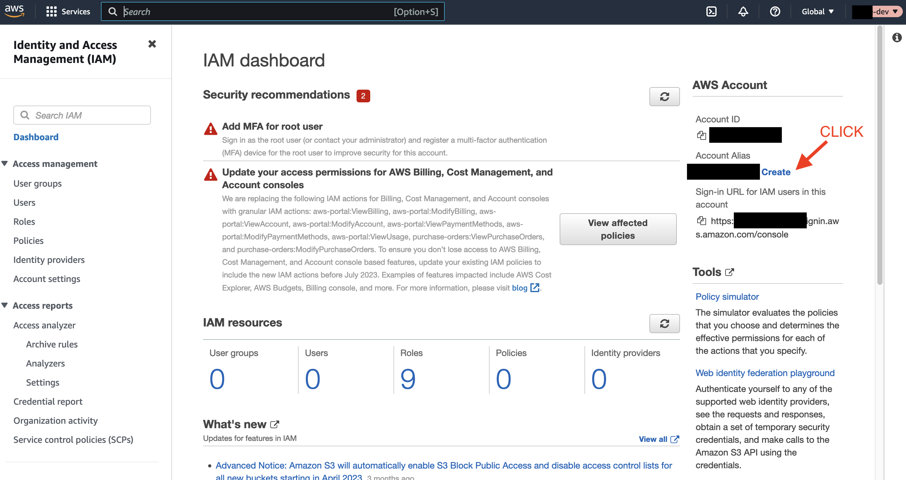
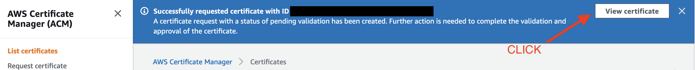
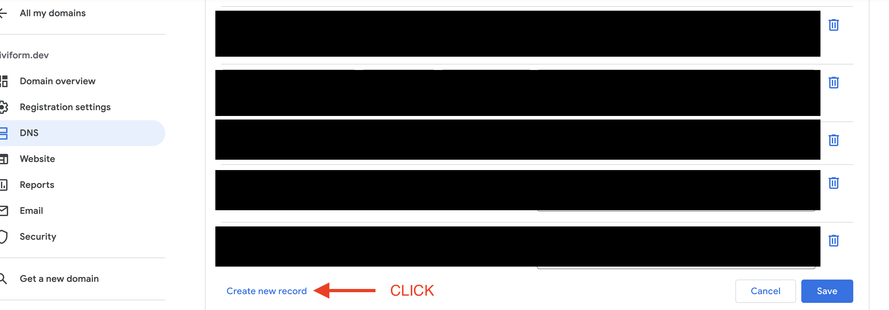
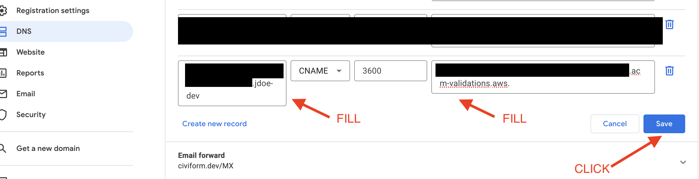
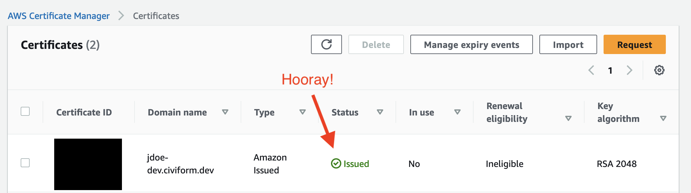
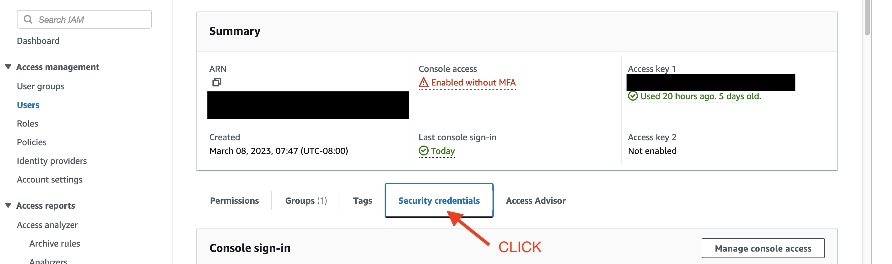
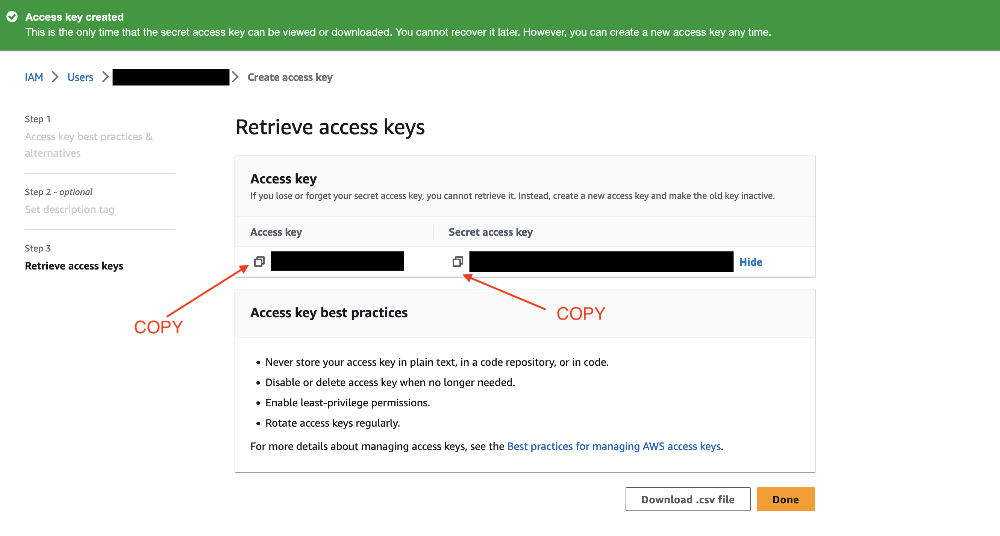

# Prerequisites and developer setup

This page contains instructions for the setup you should go through before you start development work on the deploy system.
It is intended as a step by step guide and you are encouraged to improve the documentation if any step is not straight forward in its current state.

Note: These steps are AWS specific as there are not any current production deployments using Azure or any cloud provider other than AWS. Please update the documentation accordingly as this changes.

## Install Required Tooling
* [Terraform CLI](https://developer.hashicorp.com/terraform/tutorials/aws-get-started/install-cli)
* [AWS CLI](https://docs.aws.amazon.com/cli/latest/userguide/getting-started-install.html)
* [python3](https://www.python.org/downloads/) -- Deployment scripts are mostly written in python
* [pip](https://pip.pypa.io/en/stable/installation/) -- Package installer for python (note: pip is usually installed with python)
* [yapf](https://github.com/google/yapf#installation) -- Python formatter
* [aws-nuke](https://github.com/rebuy-de/aws-nuke) -- Used to cleanup/destroy AWS resources at the end of your work session

## Get AWS Account Access
* Ask your employer to create an AWS root account for you.
* In #deployment-eng, ask to be added to the list of Users for civiform.dev in [Google Domains](https://domains.google.com)

## Setup AWS Account

### Create AWS Account

1. Log in to your company's AWS account and navigate to the [AWS Organizations page](https://us-east-1.console.aws.amazon.com/organizations/v2/home/accounts).

2. Click the 'Add an AWS account' button.
<details>
  <summary>Screenshots</summary>
  
  
</details>

3. Input the new account details and click "Create AWS account"
    - AWS account name: input your dev account name (for example `jdoe-dev`)
    - Email address of the account's owner: input your email address
    - IAM role name: leave the default of 'OrganizationAccountAccessRole'.
<details>
  <summary>Screenshots</summary>
  
  
</details>

4. Account creation will take a minute or two. Once it is created, you will see it listed on the [AWS Organizations page](https://us-east-1.console.aws.amazon.com/organizations/v2/home/root).

5. Once the account is created, copy the account number somewhere for yourself temporarily. You will need it to log in to the new account and configure it.
<details>
  <summary>Screenshots</summary>
  
  
</details>

6. (For Exygy employees only) Move the newly created dev account so that it is nested inside the `civiform-dev` folder via the following steps:
    - Select the checkbox for the new account.
    - Click the "Actions" dropdown.
    - Select "Move" under the "AWS account" section in the dropdown.
    - On the following screen, select the `civiform-dev` folder and then click the "Move AWS account" button.
<details>
  <summary>Screenshots</summary>
  
  
  
</details>

### Log in to your new dev AWS Account

1. From any screen in the AWS Console, click the drop down in the upper right hand corner and click "Switch role". 
<details>
  <summary>Screenshots</summary>
  
  
</details>

2. Click "Switch Role" on the next screen.
<details>
  <summary>Screenshots</summary>
  
  
</details>

3. Input the following details and click "Switch Role":
    - Account: Input the account number for your new dev account (copied in step 5 above).
    - Role: Input "OrganizationAccountAccessRole"
    - Display Name: Input the dev account name you created when making the account (e.g `jdoe-dev`)
<details>
  <summary>Screenshots</summary>
  
  
</details>

4. Verify that you are now viewing the newly created account by navigating to the [IAM dashboard](https://us-east-1.console.aws.amazon.com/iamv2/home?region=us-east-1#/home) and making sure that the Account ID listed in the sidebar on the right matches the account ID for your newly created dev account.
<details>
  <summary>Screenshots</summary>
  
  
</details>

Note: You only have to log in to your dev account one time. After that, it will be listed under "Role history" in the drop down in the upper right and you will be able to easily toggle back and forth between accounts by clicking on the role in that menu.

<details>
  <summary>Screenshots</summary>
  
  
</details>

### Configure new AWS Account

1. Navigate to your newly created dev account's [IAM page](https://us-east-1.console.aws.amazon.com/iamv2/home?region=us-east-1#/home).

2. Click the "Create" button under "Account Alias" on the righthand sidebar.
<details>
  <summary>Screenshots</summary>
  
  
</details>

3. Under "Preferred alias" input the name for your newly created dev account (eg. `jdoe-dev`) and click "Save changes". You will use this alias later when running `aws-nuke` to clear resources. AWS aliases must contain only lowercase letters, digits <details>
  <summary>Screenshots</summary>
  and hyphens and must be globally unique (if you get an error that the alias already exists, try another string). 
</details


4. Navigate to the [Request certificate page](https://us-east-1.console.aws.amazon.com/acm/home?region=us-east-1#/certificates/request). Keep the default "Request a public certificate" option selected and click the "Next" button.
<details>
  <summary>Screenshots</summary>
  
  
</details>

5. Input the certificate details and click "Request":
    - Fully qualified domain name: Input `<your-dev-account-name>.civiform.dev` (eg. `jdoe-dev.civiform.dev`)
    - Validation method: Leave the default selection "DNS validation - recommended" selected.
    - Key algorithm: Leave the default selection "RSA 2048" selected.
<details>
  <summary>Screenshots</summary>
  
  
</details>

6. You should be redirected to the [Certificates page](https://us-east-1.console.aws.amazon.com/acm/home?region=us-east-1#/certificates/list) and there should be a banner at the top of the page that says "Successfully requested certificate with ID ...". Click "View certificate". This will take you to the certificate details page.
<details>
  <summary>Screenshots</summary>
  
  
</details>

7. In the "Domains" section of the certificate details page, there should be a single row with `CNAME` listed under the "Type" column. The values in the "CNAME name" and "CNAME value" columns are used to validate that we control the domain (`civiform.dev`) requested by the certificate. Copy both the "CNAME name" and "CNAME value" column values somewhere for yourself temporarily, you will need them in the following steps.
<details>
  <summary>Screenshots</summary>
  
  
</details>

8. In a new tab, open the [civiform.dev DNS configuration page](https://domains.google.com/registrar/civiform.dev/dns) and click "Manage custom records".
<details>
  <summary>Screenshots</summary>
  
  
</details>9. Scroll to the bottom of this 
list and click "Create new record" (note: the UI is a little buggy you might have to click this twice to get an empty row to appear).
<details>
  <summary>Screenshots</summary>
  
  
</details>

10. Input the following details into the new row and click "Save":
    - Host name: Input the value of the "CNAME name" column you copied in step 7 above. Remove the `civiform.dev` part at the end of the string. Google Domains automatically appends this to whatever you enter. If you do not remove it, you will add a CNAME record for `<random_id>.<dev-account>.civiform.dev.civiform.dev` which is incorrect.
    - Type: Select "CNAME"
    - TTL: Leave the default value "3600"
    - Data: Input the value of the "CNAME value" column you copied in step 7 above.
<details>
  <summary>Screenshots</summary>
  
  
</details>

11. Navigate to the [Certificates page](https://us-east-1.console.aws.amazon.com/acm/home?region=us-east-1#/certificates/list) in AWS. It will take a minute or two for AWS to see and validate the new CNAME record. Once the validation has succeeded, the "Status" column of the "Certificates" list should have a green checkmark and say "Issued".
<details>
  <summary>Screenshots</summary>
  
  
</details>

## Setup AWS CLI

1.  Create the credentials file
    - Run `mkdir -p ~/.aws; touch ~/.aws/credentials` in your terminal to create a config file for `aws-cli`.
    - Open the newly created credentials file and paste in the following template:
        ```
        [default]
        role_arn = 
        source_profile = <name-of-parent-account>

        [<name-of-parent-account>]
        aws_access_key_id = 
        aws_secret_access_key =
        ```
    - `<name-of-parent-account>` can be whatever you want to call it. We recommend naming it after your dev account's parent account eg. `civiform-dev` or `exygy-root`.

2. Get the value for `role_arn`
    - In your newly created dev account, go to [IAM->Roles->OrganizationAccountAccessRole](https://us-east-1.console.aws.amazon.com/iamv2/home?region=us-east-1#/roles/details/OrganizationAccountAccessRole?section=permissions). 
    - Copy the ARN in the "Summary" section and paste this into the `aws-cli` config file you just created as the value for `role_arn`.
<details>
  <summary>Screenshots</summary>
  
  
</details>

3. Get the value for `aws_access_key_id` and `aws_secret_access_key`
    - Switch back to the AWS root account by clicking "Switch Back" from the dropdown menu in the upper right hand corner.
    - Click on your user in the [Users page](https://us-east-1.console.aws.amazon.com/iamv2/home?region=us-east-1#/users).
    - Go to the "Security credentials" tab on your user details page.
    - Scroll down to the "Access keys" section and click "Create access key"
    - Select "Command Line Interface (CLI)" from the options of "Access key best practices & alternatives", check the "I understand..." checkbox and click "Next"
    - Add a description tag if you want to (not required) and click "Create access key"
    - Copy the "Access key" and the "Secret access key" into your `aws-cli` config file as the values for `aws_access_key_id` and `aws_secret_access_key` respectively.
<details>
  <summary>Screenshots</summary>
  
  
  
  
  
  
</details>

## Test AWS Authentication From Your Local Machine
1. Test that your local machine can authenticate to the root user account
    - Run `aws sts get-caller-identity --profile <name-of-parent-account>` in your terminal. Where `<name-of-parent-account>` is the name you specified in your `aws-cli` config file.
    - The output should look something like:
        ```
        {
            "UserId": "...",
            "Account": "<root-account-number>",
            "Arn": "arn:aws:iam::<root-account-number>:user/<your-user-name>"
        }
        ```

2. Test that your dev account can authenticate with root user credentials on your local machine
    - Run `aws sts get-caller-identity` without passing in the `--profile` flag. This will use the `default` profile set in your `aws-cli` config file which, if set correctly, should use the access credentials from the root account but with your dev user role.
    - The output should look something like:
        ```
        {
            "UserId": "...:botocore-session-...",
            "Account": "<your-new-dev-account-number>",
            "Arn": "arn:aws:sts::<your-new-dev-account-number>:assumed-role/OrganizationAccountAccessRole/botocore-session-..."
        }
        ```

## Setup AWS Nuke
AWS Nuke is a package that makes it easy to remove all resources from an AWS account. You will want to run this at the end of each working session (at least at the end of each day so we don't leave resources running overnight) and anytime you need to cleanup your AWS account to test new changes. It is destructive, so it's very important to set up your config file correctly to only clear out resources from your dev account. Check out the [README for the `aws-nuke` repository](https://github.com/rebuy-de/aws-nuke) for more information about the inner workings of `aws-nuke`.
1. Download the correct binary for your machine's architecture/OS from the [aws-nuke repo](https://github.com/rebuy-de/aws-nuke/releases). Or on mac run `brew install aws-nuke` (go [here](https://brew.sh/) to install Homebrew if you don't already have it).
2. If you downloaded the binary, unpack the tarball, rename the binary to `aws-nuke` and put it somewhere in your shell's path.
3. Run `aws-nuke -h` to make sure it is installed correctly.
4. In the root directory of your local `civiform-deploy` repo, create a `nuke.yaml` file. Make sure to name the file `nuke.yaml` so it is ignored by `.gitignore`.
5. Add regions, account-blocklist, and accounts to the file. Be sure to include the AWS root account number in the account-blocklist, along with any other subaccounts you want to protect (eg. the CiviForm Staging account if you are working out of Exygy's AWS account). If in doubt, ask a coworker for their `nuke.yaml` setup. Take care to update the ACMCertificate value to the correct domain for your cert or the script will delete it every time (not the end of the world, but definitely annoying). The config file will look different depending on the AWS root account you are using, but should end up looking something like:
    ```
    regions:
        - us-east-1
        - global

    account-blocklist:
        - "<account_number_1_to_blocklist>" # Description of account number 1
        - ... additional accounts to blocklist if have them ...

    accounts:
        "<your_new_account_number>":
            filters:
                ACMCertificate:
                    - property: "DomainName"
                    value: "<your_user_name>.civiform.dev"
                IAMRole:
                    - "OrganizationAccountAccessRole"
                IAMRolePolicyAttachment:
                    - "OrganizationAccountAccessRole -> AdministratorAccess"
    ```
6. To test your configuration setup, you can run `aws-nuke --config nuke.yaml` to list all nukeable resources. You need to add the flag `--no-dry-run` to actually delete resources.
7. When you want to clean your account, run `aws-nuke --config nuke.yaml --no-dry-run`. You will be asked for confirmation twice and need to enter the account alias you chose when you created the account (eg. `jdoe-dev`). You may see error messages and `failed` messages as the script runs. These are generally safe to ignore as the error messages are related to `aws-nuke` attempting to delete resources for services we don't have setup. `failed` messages mean the script was unable to delete the resource, but it automatically retries until all specified resources are successfully deleted. 

## Setup Repositories
### [civiform-deploy](https://github.com/civiform/civiform-deploy)
1. Fork [civiform-deploy](https://github.com/civiform/civiform-deploy) (name it something unique like `<your_first_name>-civiform-deploy`) and clone your forked copy to your local machine.
2.  `cd` into the repo and run `cp civiform_config.example.sh civiform_config.sh` in your terminal to copy the example config file into the config file you will be editing.
3. Set the following values in the newly created `civiform_config.sh` file:
    - `CIVIFORM_APPLICANT_AUTH_PROTOCOL="oidc"`
    - `CIVIC_ENTITY_SHORT_NAME="<your_name>"`
    - `CIVIC_ENTITY_FULL_NAME="City of <your_name>"`
    - `CIVIC_ENTITY_SUPPORT_EMAIL_ADDRESS="<your_email_address>"` (Note: Email only matters if you are testing email functionality. If you put your real email address, you will receive an Email Address Verfication Request form AWS when you run the setup script.)
    - `SENDER_EMAIL_ADDRESS="<your_email_address>"`
    - `STAGING_PROGRAM_ADMIN_NOTIFICATION_MAILING_LIST="<your_email_address>"`
    - `STAGING_TI_NOTIFICATION_MAILING_LIST="<your_email_address>"`
    - `STAGING_APPLICANT_NOTIFICATION_MAILING_LIST="<your_email_address>"`
    - `BASE_URL="https://<your_dev_account_name>.civiform.dev"` (Note: This can be anything you want it to be, but should be similar to something a civic entity might use so it can pass some validation checks in the CiviForm app. Using your dev account name works.)
    - `STAGING_HOSTNAME="<your_dev_account_name>.civiform.dev"`
    - `APP_PREFIX="<your_dev_account_name>"` (Note: App prefix allows you to have more than one deployment in the same account. It can be set to whatever you want.)
    - `SSL_CERTIFICATE_ARN="<arn_of_the_SSL_cert>"` (Find the ARN by clicking into the Certificate ID on the [Certificates page](https://us-east-1.console.aws.amazon.com/acm/home?region=us-east-1#/certificates/list) in AWS.)
### [cloud-deploy-infra](https://github.com/civiform/cloud-deploy-infra)
1. Clone [cloud-deploy-infra](https://github.com/civiform/cloud-deploy-infra) onto your local machine.
2. Set your local copy of `civiform-deploy` to track your local copy of `cloud-deploy-infra`.
    - Set the `CLOUD_DEPLOY_INFRA_REMOTE` environment variable to override the location of the `cloud-deploy-infra` repo to your local clone. You can either do this inline with a command, such as
    ```
    CLOUD_DEPLOY_INFRA_REMOTE=/path/to/cloud-deploy-infra bin/deploy
    ```
    - Or, you can set it in your shell to have it always apply
    ```
    export CLOUD_DEPLOY_INFRA_REMOTE=/path/to/cloud-deploy-infra
    ```

## Try running `bin/setup`
Note: You will need to run this script as the first step for any working session to create and launch your deployment instance.
1. From within your local fork of `civiform-deploy`, run `bin/setup` to kick off the setup script. At a very high level this script does the following things:
    - Creates a `checkout` folder in your local copy of `civiform-deploy` and pulls in the code from `cloud-deploy-infra` that contains all of the actual implementation for deployment.
    - Runs the scripts pulled in from `cloud-deploy-infra` to deploy the instance.
    - Creates an S3 bucket in Amazon in which to store resources.
    - Creates all of the resources specified in the Terraform config files in `cloud-deploy-infra`. (Note: this step is the same as running the `bin/deploy` script.) Terraform will prompt you to type "yes" several times to confirm creation of resources.
    - Automatically retries resource creation once because of a [known bug with Terraform and AWS](https://github.com/hashicorp/terraform-provider-aws/issues/19583)
    - Prompts you to create several secrets like for login integration credentials. These strings don't matter unless you are testing applicant authentication. They can also be changed later via the AWS console.
    - Starts the server.
    - Checks for service health.
    - If everything is successful, the script will print out `Server is available on url:....` and give you a url to add to your domain registrar.
2. Navigate to the url output by the script. You will receive an `SSL_ERROR_BAD_CERT_DOMAIN` error because the certificate is only valid for the domain you defined when you created it, but if you click "Advanced" on the error page it should give you an option to proceed anyway. Proceed through the warning and you should see your live site!!
3. If you want to, you can create a new record in the [domain registrar](https://domains.google.com/registrar/civiform.dev/dns) that points your dev url (eg. `jdoe-dev.civiform.dev`) to the server URL. Enter the following values into the new record and click "Save":
    - Host name: The domain name you set when requesting your certificate (step 5 in [Configure new AWS Account](#configure-new-aws-account) above)
    - Type: CNAME
    - TTL: 3600
    - Data: URL copied from script output (will look something like `jdoe-dev-civiform-lb-<some_numbers>.us-east-1.elb.amazonaws.com`)
    
    It can take up to 20 minutes for the DNS to propagate, so don't worry if you don't see it load right away. 

Troubleshooting:
- If you get an error message about "Amazon 3 already exists", this is likely because you have run the script before (possibly unsuccessfully) and some resources were created. Run `aws-nuke --config nuke.yaml --no-dry-run` to clear out all resources and try again.
- Sometimes the service health check will fail even though the service started up correctly. The service health check repeats every 30 seconds up to 20 times. This number is arbitrary and sometimes the script will not receive the response it's expecting in the alloted time, even though the service has started up correctly. You can follow along with the service events by going to the Service URL that is output by the script directly before it starts checking for Service Health. If you see `Cluster not found.` errors, make sure you are logged into your newly created dev account in AWS and not the root account. Scroll down to events and, if you see an event like "service `<your_dev_service>` has reached a steady state", that means the deployment was successful. If the service health check times out, the script won't output the url you need to add to the domain registrar. You can find this url in AWS by navigating to `EC2 > Load balancers > <your_dev_lb>` and copying the DNS name under "Details" on that screen.
<details>
  <summary>Screenshots</summary>
  
  
</details>
- The service health checks might also fail because something is wrong with the service. It could be a problem with the values set in `civiform_config.sh` or some other issue. To debug, go to the AWS Service URL output before the health checks, and click into the "Logs" tab to see the tasks that have run. From there, you can click into individual tasks and inspect the logs for those tasks. 


TODO([#4324](https://github.com/civiform/civiform/issues/4324)) Determine what of the remaining documentation below should be moved and what can be deleted.

## Setup AWS Account

 TODO([#4324](https://github.com/civiform/civiform/issues/4324)) Clean up and move the direct checkout vs using docker into the developer guide because it contains instructions that will be needed more than once. Document why the two options exist and when to choose which.

 TODO([#4324](https://github.com/civiform/civiform/issues/4324)) Remove the documentation below this line once we have better alternatives.

### Before running scripts
1. Required to be installed: bash, python, cloud provider CLIs.
2. User needs to be authenticated with cloud provider.
    * AWS: run `aws configure` or export `AWS_ACCESS_KEY_ID` and `AWS_SECRET_ACCESS_KEY`
    * Azure: run `az login`

## Development setup for development across git branches

Most deployment system changes happen in the cloud-deploy-infra repository. The deployment script however is located in the civiform-deploy repository.Therefore additional steps have to be taken so changes made to the cloud-deploy-infra repository are visible when you run the setup.py script: 

### Option 1: Direct checkout
Use git to copy a part of the cloud-deploy-infra repository into the civiform-deploy repository before running the setup.sh script:

All scripts currently do the following:
1. Source civiform config which exports variables to ENV.
2. Require `CIVIFORM_CLOUD_DEPLOYMENT_VERSION` to be set. This determines which version is getting checked out in the next step.
2. Checkout remote repo (see [checkout.sh](https://github.com/civiform/civiform-deploy/blob/main/bin/lib/checkout.sh)) into checkout/ folder.
3. Call [run.py](https://github.com/civiform/cloud-deploy-infra/blob/main/cloud/shared/bin/run.py)

### Option 2: Using Docker (preferred going forward, but not fully ready yet)
Build a new docker image [civiform/civiform-cloud-deployment](https://hub.docker.com/r/civiform/civiform-cloud-deployment) on every commit to `cloud-deploy-infra` repo and use it to run commands.

A [Github action](https://github.com/civiform/cloud-deploy-infra/blob/main/.github/workflows/build_push_image.yaml) calls the [build script](https://github.com/civiform/cloud-deploy-infra/blob/main/bin/build-cloud-deployment) that uses  [Dockerfile](https://github.com/civiform/cloud-deploy-infra/blob/main/cloud/cloud.Dockerfile).

In the image:
* All dependencies that we need, including versions of CLIs used, and python packages.
* Copy of cloud/ directory with the scripts to run.

In civiform-deploy:
1. When env variable `USE_DOCKER=true` it will call [run-from-docker](https://github.com/civiform/civiform-deploy/blob/main/bin/lib/run_from_docker) script.
2. We're passing env variables used to Authentication with cloud provider to the image.
3. `CIVIFORM_CLOUD_DEPLOYMENT_VERSION` is used as a tag to get image from Dockerhub.
4. Inside the image call  [run.py](https://github.com/civiform/cloud-deploy-infra/blob/main/cloud/shared/bin/run.py).


### Get access

You will need to reach out to team members to get accounts for the following:

For AWS:
- AWS account 
- (optional) Auth0 Civiform-Staging

For Azure:
- Azure (must be added as a contributor AND owner)
- AWS account (yes, we use it in Azure deploy)
- (optional) Login Radius Civiform-Staging 

