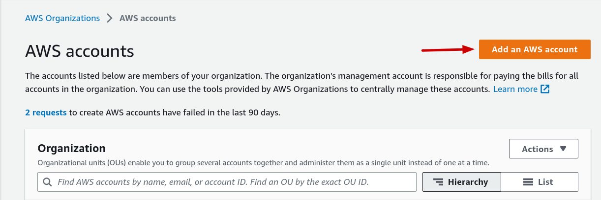
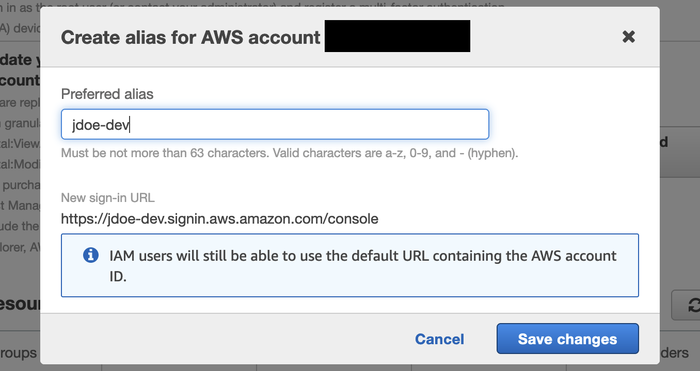

# Prerequisits and developer setup

This page contains instructions for the setup you should go through before you start development work on the deploy system.
It is intended as a step by step guide and you are encouraged to improve the documentation if any step is not straight forward in its current state.

Note: These steps are AWS specific as there are not any current production deployments using Azure or any cloud provider other than AWS. Please update the documentation accordingly as this changes.

## Install Required Tooling
* [Terraform CLI](https://developer.hashicorp.com/terraform/tutorials/aws-get-started/install-cli)
* [AWS CLI](https://docs.aws.amazon.com/cli/latest/userguide/getting-started-install.html)
* [python3](https://www.python.org/downloads/) -- Deployment scripts are mostly written in python
* [pip](https://pip.pypa.io/en/stable/installation/) -- Package installer for python (note: pip is usually installed with python)
* [yapf](https://github.com/google/yapf#installation) -- Python formatter
* [aws-nuke](https://github.com/rebuy-de/aws-nuke) -- Used to cleanup/destroy AWS resources at the end of your work session

## Get Account Access
* Ask your employer to create an AWS root account for you.
* In #deployment-eng, ask to be added to the list of Users for civiform.dev in [Google Domains](https://domains.google.com)

## Setup AWS Account
### Create AWS Account
1. Log in to your company's AWS account and navigate to the [AWS Organizations page](https://us-east-1.console.aws.amazon.com/organizations/v2/home/accounts).
2. Click the 'Add an AWS account' button.

3. Input the new account details and click "Create AWS account"
    - 'AWS account name' field: input your dev account name (for example `jdoe-dev`)
    - 'Email address of the account's owner' field: input your email address
    - 'IAM role name" field: leave the default of 'OrganizationAccountAccessRole'.

4. Account creation will take a minute or two. Once it is created, you will see it listed on the [AWS Organizations page](https://us-east-1.console.aws.amazon.com/organizations/v2/home/root).
5. Once the account is created, copy the account number somewhere for yourself temporarily. You will need it to log in to the new account and configure it.

6. (For Exygy employees only) Move the newly created dev account so that it is nested inside the `civiform-dev` folder via the following steps:
    - Select the checkbox for the new account.
    - Click the "Actions" dropdown.
    - Select "Move" under the "AWS account" section in the dropdown.
    - On the following screen, select the `civiform-dev` folder and then click the "Move AWS account" button.


### Log in to new AWS Account
1. From any screen in the AWS Console, click the drop down in the upper right hand corner and click "Switch role". 

2. Click "Switch Role" on the screen that renders.

3. Input the following details and click "Switch Role":
    - Account: Input the account number for your new dev account (copied in step 5 above).
    - Role: Input "OrganizationAccountAccessRole"
    - Display Name: Input the dev account name you created when making the account (e.g `jdoe-dev`)

4. Verify that you are now viewing the newly created account by navigating to the [IAM dashboard](https://us-east-1.console.aws.amazon.com/iamv2/home?region=us-east-1#/home) and making the Account ID listed in the sidebar on the right matches the account ID for your newly created dev account.


Note: You only have to log in to your dev account one time. After that, it will be listed under "Role history" in the drop down in the upper right and you will be able to easily toggle back and forth between accounts via clicking on the role in that menu.


### Configure new AWS Account
1. Navigate to your newly created dev account's [IAM page](https://us-east-1.console.aws.amazon.com/iamv2/home?region=us-east-1#/home).
2. Click the "Create" button next to the Account Number on the righthand sidebar.

3. Under "Preferred alias" input the name for your newly created dev account (eg. `jdoe-dev`) and click "Save changes". You will use this alias later when running `aws-nuke` to clear resources.

4. Navigate to the [Request certificate page](https://us-east-1.console.aws.amazon.com/acm/home?region=us-east-1#/certificates/request). Keep the default "Request a public certificate" option selected and click the "Next" button.

5. Input the certificate details and click "Request":
    - Full qualified domain name: Input `<your-dev-account-name>.civiform.dev` (eg. `jdoe-dev.civiform.dev`)
    - Validation method: Leave the default selection "DNS validation - recommended" selected.
    - Key algorithm: Leave the default selection "RSA 2048" selected.

6. You should be redirected to the [Certificates page](https://us-east-1.console.aws.amazon.com/acm/home?region=us-east-1#/certificates/list) and there should be a banner at the top of the page that says "Successfully request certificate with ID ...". Click "View certificate". This will take you to the certificate details page.

7. In the "Domains" section of the certificate details page, there should be a single row with `CNAME` listed under the "Type" column. The values in the "CNAME name" and "CNAME value" columns are used to validate that we control the domain (`civiform.dev`) requested by the certificate. Copy both the "CNAME name" and "CNAME value" column values somewhere for yourself temporarily, you will need them in the following steps.

8. In a new tab, open the [civiform.dev DNS configuration page](https://domains.google.com/registrar/civiform.dev/dns) and click "Manage custom records".

9. Scroll to the bottom of this list and click "Create new record" (note: the UI is a little buggy you might have to click this twice to get an empty row to appear).

10. Input the following details into the new row and click "Save":
    - Host name: Input the value of the "CNAME name" column you copied in step 7 above. Remove the `civiform.dev` part at the end of the string. Google Domains automatically appends this to whatever you enter. If you do not remove it, you will add a CNAME record for `<random_id>.<dev-account>.civiform.dev.civiform.dev` which is incorrect.
    - Type: Select "CNAME"
    - TTL: Leave the default value "3600"
    - Data: Input the value of the "CNAME value" column you copied in step 7 above.

11. Navigate to the [Certificates page](https://us-east-1.console.aws.amazon.com/acm/home?region=us-east-1#/certificates/list) in AWS. It will take a minute or two for AWS to see and validate the new CNAME record. Once the validation has succeeded, the "Status" column of the "Certificates" list should have a green checkmark and say "Issued".


## Setup AWS CLI
### Create the credentials file
* Run `touch ~/.aws/credentials` in your terminal to create a config file for `aws-cli`.
* Open the newly created config file and paste in the following template:
```
[default]
role_arn = 
source_profile = <name-of-parent-account>

[<name-of-parent-account>]
aws_access_key_id = 
aws_secret_access_key =
```
<name-of-parent-account> can be whatever you want to call it. We recommend naming it after your dev's parent account eg. `civiform-dev` or `exygy-root`.

### Get the value for `role_arn`
* In your newly created dev account, go to [IAM->Roles->OrganizationAccountAccessRole](https://us-east-1.console.aws.amazon.com/iamv2/home?region=us-east-1#/roles/details/OrganizationAccountAccessRole?section=permissions). 
* Copy the ARN in the "Summary" section and paste this into the `aws-cli` config file you just created as the value for `role_arn`.
ADD SCREENSHOT

### Get the value for `aws_access_key_id` and `aws_secret_access_key`
* Switch back to the AWS root account by clicking "Switch Back" from the dropdown menu in the upper right hand corner.
* Click on your user in the [Users page](https://us-east-1.console.aws.amazon.com/iamv2/home?region=us-east-1#/users).
* Go to the "Security credentials" tab on your user details page.

* Scroll down to the "Access keys" section and click "Create access key"

* Select "Command Line Interface (CLI)" from the options of "Access key best practices & alternatives", check the "I understand..." checkbox and click "Next"

* Add a description tag if you want to (not required) and click "Create access key"

* Copy the "Access key" and the "Secret access key" into your `aws-cli` config file as the values for `aws_access_key_id` and `aws_secret_access_key` respectively.


## Test AWS authentication from your local machine
### Test that your local machine can authenticate to the root user account
* run `aws sts get-caller-identity --profile <name-of-parent-account>` in your terminal. Where `<name-of-parent-account>` is the name you specified in your `aws-cli` config file.
* The output should look something like:
```
{
    "UserId": "...",
    "Account": "<root-account-number>",
    "Arn": "arn:aws:iam::<root-account-number>:user/<your-user-name>"
}
```
### Test that your dev account can authenticate with root user credentials on your local machine
* run `aws sts get-caller-identity` without passing in the `--profile` flag. This will use the `default` profile set in your `aws-cli` config file which, if set correctly, should use the access credentials from the root account but with your dev user role.
* The output should look something like:
```
{
    "UserId": "...:botocore-session-...",
    "Account": "<your-new-dev-account-number>",
    "Arn": "arn:aws:sts::<your-new-dev-account-number>:assumed-role/OrganizationAccountAccessRole/botocore-session-..."
}
```

## Clone/Fork Repos
### [civiform-deploy](https://github.com/civiform/civiform-deploy)
* Fork [civiform-deploy](https://github.com/civiform/civiform-deploy) and clone your forked copy to your local machine.
* `cd` into the repo and run `cp civiform_config.example.sh civiform_config.sh` in your terminal to copy the example config file into the config file you will be editing.
### [cloud-deploy-infra](https://github.com/civiform/cloud-deploy-infra)
* 


## Setup AWS Account

 TODO([#4324](https://github.com/civiform/civiform/issues/4324))This entire page needs to be rewritten. For each item in the list explain what it is and how to install/get it, remove or change the existing documentation below as required. 
<<<<<<< HEAD
 * Access you need to ask for to not get blocked on later steps(Google domains, AWS, Azure) and who to ask for it
 * Required tools(python3, terraform etc, pip, yapf)
 * AWS accounts(including differences depending on who your employer is)
 * AWS CLI
=======
>>>>>>> c8df748 (first pass through required tooling and aws setup)
 * AWS nuke

 TODO([#4324](https://github.com/civiform/civiform/issues/4324)) Clean up and move the direct checkout vs using docker into the developer guide because it contains instructions that will be needed more than once. Document why the two options exist and when to choose which.

 TODO([#4324](https://github.com/civiform/civiform/issues/4324)) Remove the documentation below this line once we have better alternatives.

### Before running scripts
1. Required to be installed: bash, python, cloud provider CLIs.
2. User needs to be authenticated with cloud provider.
    * AWS: run `aws configure` or export `AWS_ACCESS_KEY_ID` and `AWS_SECRET_ACCESS_KEY`
    * Azure: run `az login`

## Development setup for development across git branches

Most deployment system changes happen in the cloud-deploy-infra repository. The deployment script however is located in the civiform-deploy repository.Therefore additional steps have to be taken so changes made to the cloud-deploy-infra repository are visible when you run the setup.py script: 

### Option 1: Direct checkout
Use git to copy a part of the cloud-deploy-infra repository into the civiform-deploy repository before running the setup.sh script:

All scripts currently do the following:
1. Source civiform config which exports variables to ENV.
2. Require `CIVIFORM_CLOUD_DEPLOYMENT_VERSION` to be set. This determines which version is getting checked out in the next step.
2. Checkout remote repo (see [checkout.sh](https://github.com/civiform/civiform-deploy/blob/main/bin/lib/checkout.sh)) into checkout/ folder.
3. Call [run.py](https://github.com/civiform/cloud-deploy-infra/blob/main/cloud/shared/bin/run.py)

## Option 2: Using Docker (preferred going forward, but not fully ready yet)
Build a new docker image [civiform/civiform-cloud-deployment](https://hub.docker.com/r/civiform/civiform-cloud-deployment)on every commit to civiform-deploy-infra repo and use it to run commands.

A [Github action](https://github.com/civiform/cloud-deploy-infra/blob/main/.github/workflows/build_push_image.yaml) calls the [build script](https://github.com/civiform/cloud-deploy-infra/blob/main/bin/build-cloud-deployment) that uses  [Dockerfile](https://github.com/civiform/cloud-deploy-infra/blob/main/cloud/cloud.Dockerfile).

In the image:
* All dependencies that we need, including versions of CLIs used, and python packages.
* Copy of cloud/ directory with the scripts to run.

In civiform-deploy:
1. When env variable `USE_DOCKER=true` it will call [run-from-docker](https://github.com/civiform/civiform-deploy/blob/main/bin/lib/run_from_docker) script.
2. We're passing env variables used to Authentication with cloud provider to the image.
3. `CIVIFORM_CLOUD_DEPLOYMENT_VERSION` is used as a tag to get image from Dockerhub.
4. Inside the image call  [run.py](https://github.com/civiform/cloud-deploy-infra/blob/main/cloud/shared/bin/run.py).


### Get access

You will need to reach out to team members to get accounts for the following:

For AWS:
- AWS account 
- (optional) Auth0 Civiform-Staging

For Azure:
- Azure (must be added as a contributor AND owner)
- AWS account (yes, we use it in Azure deploy)
- (optional) Login Radius Civiform-Staging 

