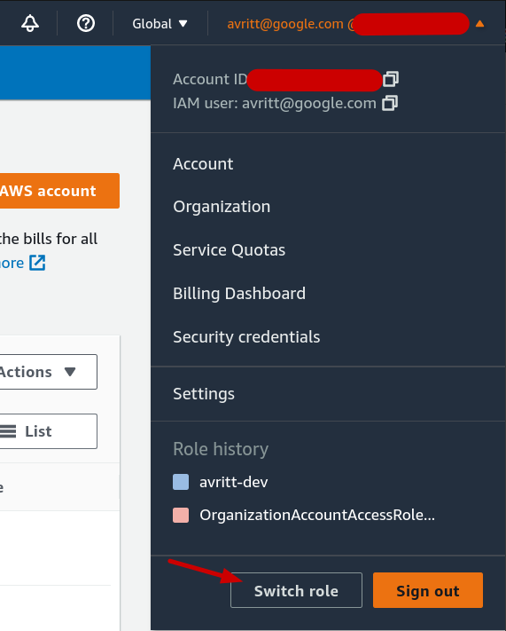
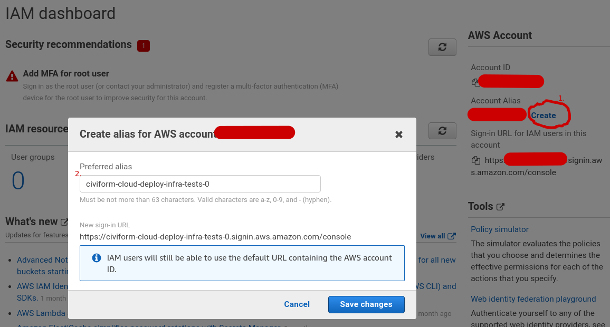
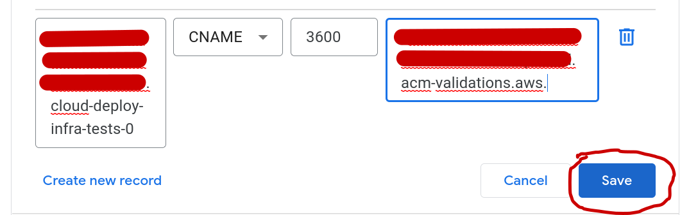

# Deploy system testing overview

## Code

Deployment related code can be found in
[civiform/cloud-deploy-infra](https://github.com/civiform/cloud-deploy-infra).

Scripts that a user would run are in
[civiform/civiform-deploy](https://github.com/civiform/civiform-deploy).

## Unit tests

Current unit test coverage is unknown but likely low. Select python files have
associated \_test.py tests. These tests are run on every pull request using the
[run_pytest](https://github.com/civiform/cloud-deploy-infra/blob/main/.github/workflows/run_pytest.yaml)
github action.

## End to end (e2e) tests

The current e2e testing implementation is the minimum viable setup. The
[end-to-end testing implementation decision
log](https://docs.google.com/document/d/1y1IFnuorFIsGJggMwJdLgAHtGMGPr9XDd8AdXH5VAlw/edit?usp=sharing)
contains details on each implementation decision made, different options
considered, and what decision was made. Most aspects of the implementation can
be iterated on to provide a more robust, secure, and developer-friendly e2e
testing framework. Each decision contains rational for when such iteration may
be worth the implementation and maintenance cost.

We currently run one e2e test every day at 1:23 UTC via GitHub actions. The
test runs the deploy tool in a dedicated testing AWS account. The action runs
[aws-nuke](https://github.com/rebuy-de/aws-nuke) before and after the deploy
tool to clean the account.

### AWS e2e test account setup

There is currently one AWS account used for e2e tests. It is created under the
root CiviForm dev organization and named 'cloud-deploy-infra-tests-0'.

The account creation and configurations process was:

1. Created a new e2e test account in the CiviForm dev AWS organization.
2. Logged into the new account by switching roles into the default
   OrganizationAccountAccessRole role created in the new account.
3. Added an account alias for the new account.
4. Added an AWS Certificate Manager certificate in the new account.
5. Added the GitHub OpenID Connect (OIDC) identity provider to the new AWS
   account.
6. Added an e2e-test-runner role that can be assumed by entities provided by
   the GitHub OIDC provider (GitHub action runners).
7. Edited the e2e-test-runner role trust policy so that only GitHub action
   runners scoped to the civiform/cloud-deploy-infra main branch are allowed to
   assume the e2e-test-runner role.

Steps to create an additional test account:

#### Create a new e2e test account

1. Log in to the CiviForm dev AWS account and navigate to the ['AWS
   Organizations'
   page](https://us-east-1.console.aws.amazon.com/organizations/v2/home/root).
   If you don't have the login details and don'tknow who to ask, 
   please reach out on the engineering slack channel in the [CiviForm Slack workspace](https://civiform.slack.com/).

2. Determine the next test account number by looking at the
   'cloud-deploy-infra-tests-N' accounts in the 'cloud-deploy-infra-tests'
   organizational unit account list. For example, if there was only one account
   'cloud-deploy-infra-tests-0', the next test account number would be 1. If
   there were two accounts 'cloud-deploy-infra-tests-0' and
   'cloud-deploy-infra-tests-1', the next test account number would be 2.

	

3. Go to [AWS Accounts](https://us-east-1.console.aws.amazon.com/organizations/v2/home/accounts) and click the 'Add an AWS account' button.

	

4. Input the new account details:

   - 'AWS account name' field: input 'cloud-deploy-infra-tests-N' where N is
	 the next test account number.  For example, if the next test account
	 number was 2, input 'cloud-deploy-infra-tests-2'.
   - 'Email address of the account's owner' field: input
	 'cloud-deploy-infra-tests+N@civiform.dev' where N is the next test account
	 number. For example, if the next test account number was 2, input
	 'cloud-deploy-infra-tests+2@civiform.dev'.
   - 'IAM role name" field: leave the default of
	 'OrganizationAccountAccessRole'.
	
	

5. Click the 'Create AWS account' button. The account creation will take a
minute or two. Once it is created you will see it in the 'Organizational
structure' list on the ['AWS Organizations'
page](https://us-east-1.console.aws.amazon.com/organizations/v2/home/root)
page. **Copy the account number listed for the newly created account. You will
need it to log into the new account and configure it.**

6. Select the checkbox for the new account, click the 'Actions' button, then
click the 'Move' button under the 'AWS account' section in the dropdown.

	

7. Select the 'cloud-deploy-infra-tests' organizational unit then click the
'Move AWS account' button.

	

#### Log into a e2e test account

1. Click on the top-rightmost dropdown then click the 'Switch role' button.

	
	
You will likely see warnings that "you don't have permissions". This is normal
because you are now logged in with a none-root account.

2. Input the following details:

  - 'Account' field: input the account number you want to log in to.
  - 'Role' field: input 'OrganizationAccountAccessRole'.
  - 'Display Name' field: input 'cloud-deploy-infra-tests-N 'where N is the
	next test account number.  For example, if the next test account number was
	2, input 'civiform-cloud-deploy-infra-tests-2'.

	

3. Click the 'Switch Role' button.  You should now be viewing the newly created
account. To verify, navigate to the ['IAM
dashboard'](https://us-east-1.console.aws.amazon.com/iamv2/home?region=us-east-1#/home).
On the right sidebar, the 'Account ID' should match the account number of the
newly created account.

#### Configure a e2e test account

1. Navigate to the ['IAM'
page](https://us-east-1.console.aws.amazon.com/iamv2/home?region=us-east-1#/home).

2. Click the 'Create' button next to the 'Account Alias' on the right sidebar.
Input 'civiform-cloud-deploy-infra-tests-N' where N is the next test account
number.  For example, if the next test account number was 2, input
'civiform-cloud-deploy-infra-tests-2'. The account alias is needed to run
aws-nuke on the account.
 Then click the "save changes" button.

	

3. Navigate to the ['AWS Certificate Manager > Certificates > Request
certificate'
page](https://us-east-1.console.aws.amazon.com/acm/home?region=us-east-1#/certificates/request).
Keep the default 'Request a public certificate' option selected. Click the
'Next' button.

	

4. Input the certificate details:

	- 'Fully qualified domain name' field: input 'cloud-deploy-infra-tests-N'
	  where N is the next test account number.  For example, if the next test
	  account number was 2, input 'civiform-cloud-deploy-infra-tests-2'.
	- 'Validation method' selection: keep the default selection of 'DNS
	  validation - recommended' selected.
	- 'Key algorithm' selection: keep the default selection of 'RSA 2048'
	  selected.

	

5. Click the 'Request' button.

6. You should be redirected to the ['AWS Certificate Manager > Certificates'
page](https://us-east-1.console.aws.amazon.com/acm/home?region=us-east-1#/certificates/list)
and there should be a banner at the top of the page that says 'Successfully
requested certificate with ID ...'.  Click the 'View certificate' button in the
banner.

	

7. In the 'Domains' section of the certificate detail page, there should be a
single row with 'CNAME' in the 'Type' column. The values in the 'CNAME name'
and 'CNAME value' columns are used to validate that we control the domain
(civiform.dev) requested by the certificate. Copy both the 'CNAME name' and
'CNAME value' column values, you will need them in the following steps.

	

8. In a new tab, open the [civiform.dev DNS configuration
page](https://domains.google.com/registrar/civiform.dev/dns). Click the 'Manage
custom records' button in the 'Resource records > Custom records' box. 
If what you see is different to the below, you likely need to be added as a member to 
the google domains account. Please reach out on the engineering slack channel in the [CiviForm Slack workspace](https://civiform.slack.com/),
if you don't know who to ask about access.

	

9. Click the "create new record" button at the bottom of the list.
Input the following details:

	- 'Host name' field: input the value of the 'CNAME name' column. Remove the
	  '.civiform.dev' part at the end of the string. Google Domains
	  automatically appends this to whatever you enter. If you do not remove
	  it, you will add a CNAME record for
	  '<random_id>.cloud-deploy-infra-tests-N.civiform.dev.civiform.dev' which
	  is incorrect.
	- 'Type' selection: choose 'CNAME'.
	- 'TTL' field: leave the default of '3600'.
	- 'Data' field: input the value of the 'CNAME value' column.
	
  

10. Click the 'Save' button. It will take a minute or two for AWS to see and
validate the new CNAME record. Navigate to the ['AWS Certificate Manager >
Certificates'
page](https://us-east-1.console.aws.amazon.com/acm/home?region=us-east-1#/certificates/list).
Once the validation has succeeded, the 'Status' column of the 'Certificates'
list should say 'Issued'.

	

11. Navigate to the ['IAM > Identity providers'
page](https://us-east-1.console.aws.amazon.com/iamv2/home?region=us-east-1#/identity_providers).

12. Click the 'Add provider' button.

	

13. Input the new provider details:

	- 'Provider type' selection: choose 'OpenID Connect'.
	- 'Provider URL' field: input
	  'https://token.actions.githubusercontent.com'. Click the 'Get thumbprint'
	  button.
	- 'Audience' field: input 'sts.amazonaws.com'.

	.

14. Click the 'Add provider' button.
15. Navigate to the ['IAM > Roles'
page](https://us-east-1.console.aws.amazon.com/iamv2/home?region=us-east-1#/roles).

16. Click the 'Create role' button.

	.

17. Input the new role identity provider details:

	- 'Trusted entity type' selection: choose 'Web identity'.
	- 'Identity provider' dropdown: choose
	  'token.actions.githubusercontent.com'.
	- 'Audience' dropdown: choose 'sts.amazonaws.com'.

	

18. Click the 'Next' button. In the 'Permissions policies' screen, search for
'AdministratorAccess'. Select the 'AdministratorAccess' policy. Click the
'Next' button.

	

19. Input the  new role details:

	- 'Role name' field: input 'e2e-test-runner'.
	- 'Description' field: input 'Role used by GitHub actions to run end-to-end
	  tests'.

20. Click the 'Create role' button. The created role should now be visible in
the ['IAM > Roles'
page](https://us-east-1.console.aws.amazon.com/iamv2/home?region=us-east-1#/roles).
Click on the 'e2e-test-runner' role name.

	

21. In the 'e2e-test-runner' role details screen, click on the 'Trust
relationships' tab then on the 'Edit trust policy' button.

	

22. Add `"token.actions.githubusercontent.com:sub":
"repo:civiform/cloud-deploy-infra:ref:refs/heads/main"` to the
`Statement.Condition.StringEquals` object.

	

23. Click the 'Update policy' button.
