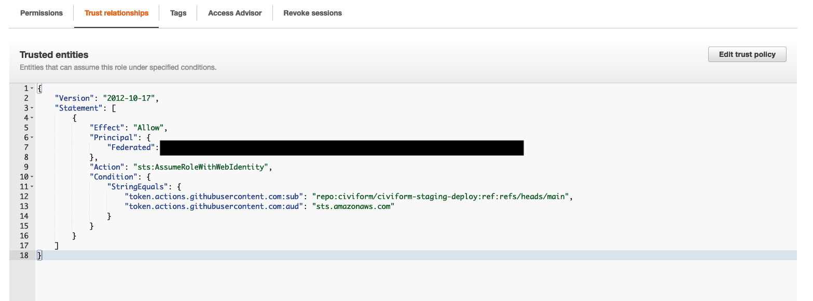
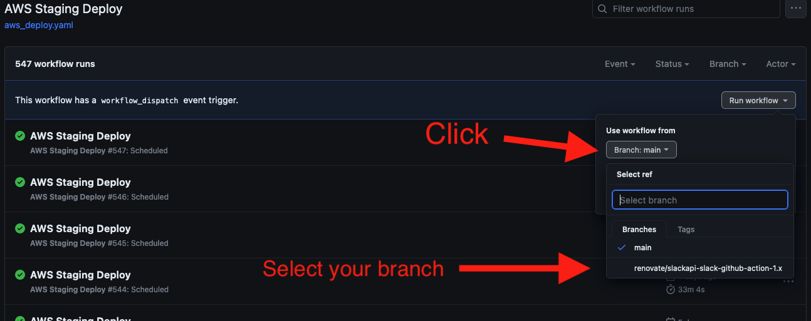

## Overview

Our AWS staging instance is available at https://staging-aws.civiform.dev

Configuration and deployment of our staging instance is managed by the [`civiform_staging_deploy` repository](https://github.com/civiform/civiform-staging-deploy) which is forked from the [`civiform_deploy` repository](https://github.com/civiform/civiform-deploy). Our AWS instance specifically is configured in the [`aws_staging_civiform_config.sh` file](https://github.com/civiform/civiform-staging-deploy/blob/main/aws_staging_civiform_config.sh).

Staging is re-deployed with the latest code on the main branch of the [`civiform` repository](https://github.com/civiform/civiform) daily at 6pm PDT (1am UTC). Deploys are managed by [this github workflow](https://github.com/civiform/civiform-staging-deploy/blob/main/.github/workflows/aws_deploy.yaml). You can see details of previous deploy runs, including deploy logs, by clicking into a specific deploy in Github Actions [here](https://github.com/civiform/civiform-staging-deploy/actions/workflows/aws_deploy.yaml). Results of deploys and links to specific runs are also posted in the #ci channel in Slack.

## How to trigger a staging deploy

It's possible to trigger a manual run from the main branch or another working branch in `civiform-staging-deploy`. This is extremely helpful when debugging failed staging deploys, or when testing out changes to the `civiform-staging-deploy` repository.

### To trigger a manual deploy from the main branch:

1. Go to [`AWS Staging Deploy`](https://github.com/civiform/civiform-staging-deploy/actions/workflows/aws_deploy.yaml) under "Actions" and click the "Run workflow" dropdown.
2. Select or unselect the "Runs probers when checked" box depending on if you would like prober tests to run (we recommend unselecting this box when debugging deploys to save time).
3. Click the green "Run workflow" button.
4. It may take a minute for the new job to show up on the screen. Try refreshing your browser window if you don't see it.

  
Screenshots

  
  

### To trigger a manual deploy from a branch other than main:

1. Update the ["Trust Policy"](https://us-east-1.console.aws.amazon.com/iamv2/home?region=us-east-1#/roles/details/civiform-staging-deploy-action?section=trust_relationships) in the `civiform-staging` AWS account to point to your branch.
2. Go to [`AWS Staging Deploy`](https://github.com/civiform/civiform-staging-deploy/actions/workflows/aws_deploy.yaml) under "Actions" and click the "Run workflow" dropdown.
3. Select your branch from the dropdown.
4. Select or unselect the "Runs probers when checked" box depending on if you would like prober tests to run (we recommend unselecting this box when debugging deploys to save time).
5. Click the green "Run workflow" button.
6. Once you are done testing deployments from your branch, reset the Trust Policy in AWS back to "main".

  
Screenshots

  
  
  
  

## How to check AWS logs (staging)

For Exygy employees, make sure your AWS account is set up with the *OrganizationAccountAccessRole*.  See [prerequisites document](https://github.com/civiform/docs/blob/main/docs/contributor-guide/developer-guide/deploy-system/prerequisites.md).

For all others, ask an Exygy employee to [create a user](https://us-east-1.console.aws.amazon.com/iamv2/home?region=us-east-1#/users/create) for you in the `civiform-staging` AWS account and add you to the [staging-admins user group](https://us-east-1.console.aws.amazon.com/iamv2/home?region=us-east-1#/groups/details/staging-admins?section=users) (screenshot instructions below). 

  
Screenshots

  
  
  
  

After securing a user account, follow this [link](https://us-east-1.console.aws.amazon.com/ecs/v2/clusters/exygy-civiform/services/exygy-civiform-service/logs?region=us-east-1) or manually navigate with the steps below.

1. From the AWS Organizations Dashboard, enter ECS into the Search bar at the top of the page.
2. Click on “Elastic Container Service” from the list of results.
3. Click on “Clusters” in the left menu.
4. If the “exygy-civiform” cluster doesn’t appear in the list, select “N. Virginia” from the region dropdown menu at the top right.
5. Click on the “exygy-civiform” cluster.
6. Click on “exygy-civiform-service”.
7. Select the “Logs” tab.
8. Search for the desired logs by using the filter.
9. If you want more detailed logs, including stack traces, click on “View in CloudWatch”.
