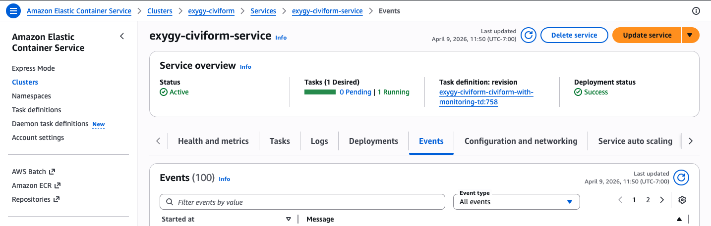
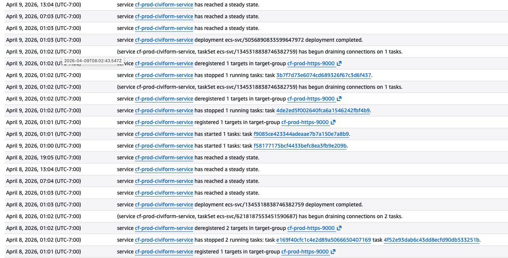

# Checking AWS ECS Events

## Background

When applicants report 500 errors or you notice them in ECS logs, you may see errors like:

```
SQLTransientConnectionException: HikariPool-default - Connection is not available, request timed out after 30000ms.
```

This usually means the application could not obtain a database connection in time, requests to the database are timing out, or that the connection pool (HikariPool) is exhausted.

When this happens, ECS may mark the container unhealthy because it can no longer reach the database, then replace the task.

Possible causes include a heavy database query (for example, during a large application export), problems with the RDS instance, networking issues within the VPC, or other factors that are still being investigated by the CiviForm team. The exact cause is not always clear from ECS events alone.

This guide walks through how to check ECS Events for task replacements that coincide with these errors. For how to find and filter application logs in ECS, see [Finding and Filtering ECS Logs](finding-and-filtering-ecs-logs.md).

## How to Check ECS Events

1. Sign in to the [AWS Console](https://console.aws.amazon.com/) and select the correct account and region from the top-right dropdown.
2. Go to **Amazon Elastic Container Service** → **Clusters**.
3. Click your CiviForm cluster (e.g., `prod-civiform`).
4. Under the **Services** tab, click your service (e.g., `prod-civiform-service`).
5. Select the **Events** tab.
6. Filter the date range to cover the time window when errors were reported.

If you've landed in the right place, you should see the **Events** tab for your service with a filterable list of events, like this:



## What to Look For

Look for a line like `Amazon ECS replaced 1 tasks due to an unhealthy status`. This means ECS replaced a container that could no longer pass health checks, typically because it had stopped connecting to the database.

During a planned deployment, you will see tasks start and stop, targets deregister, connections drain, etc, which is normal behavior.

This is an example of what the events will look like during a normal deployment. Note there is no `replaced ... due to an unhealthy status` line:

