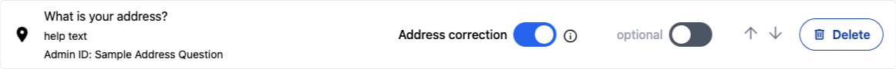
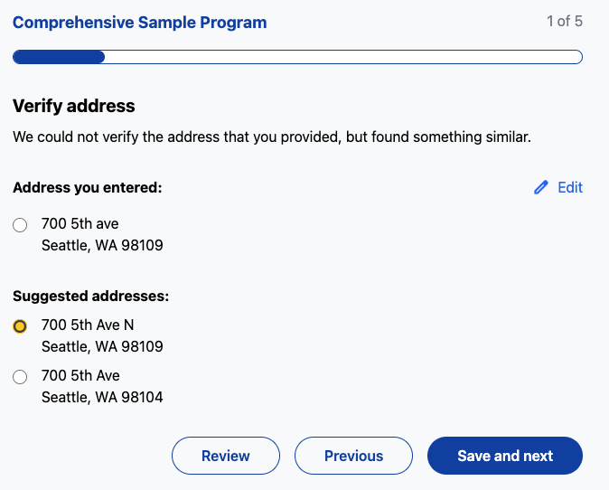
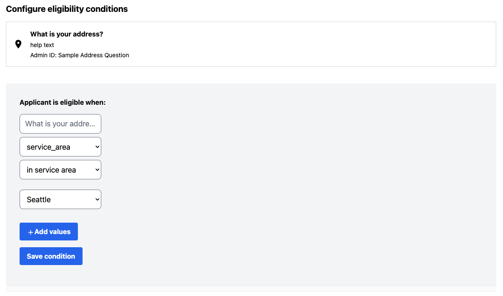

# How to configure your GIS service for address correction and service area validation

You may have some programs that need to collect an applicant's address to offer
services. Those programs may also want to verify that the address exists and
matches a standard format, and may also want to verify that the address is in
the area that's eligible for the program. For example, a program may only be for 
applicants living in a certain county. CiviForm uses the external Esri service
for both these use cases. CiviForm is not currently compatible with other
geolocation services. If you'd like to use another geolocation service, please
reach out to the engineering team.

## Address Correction

Programs may want to have an applicant's address corrected so that they can
verify the address exists and have all addresses in a standard format. This
needs to be configured both at the deployment level and at a question level.

If you want to see what results address correction might provide, you can
experiment with ArcGIS's world endpoint. [Here's a sample query for 700 5th Ave, Seattle WA 98101](https://geocode.arcgis.com/arcgis/rest/services/World/GeocodeServer/findAddressCandidates?Address=700+5th+Ave&City=Seattle&Region=WA&Postal=98101&f=pjson).
For your official deployment, you could choose to
[use this endpoint](https://www.postman.com/esridevs/workspace/arcgis-location-services/request/15786767-3c13e739-ad89-496d-9ddd-7746b2335dd0)
instead of defining your own, but you would still need to purchase an Esri
subscription and create an Esri API token.

### Deployment-level configuration

Before any specific program can use address correction, it must be enabled for
your deployment as a whole.

1. Set [ESRI_ADDRESS_CORRECTION_ENABLED](https://github.com/civiform/civiform/blob/fd0aaa002e2ee01d378ca90f236c316641ed0101/server/conf/application.conf#L725) to true.

2. Set [ESRI_FIND_ADDRESS_CANDIDATES_URL](https://github.com/civiform/civiform/blob/fd0aaa002e2ee01d378ca90f236c316641ed0101/server/conf/application.conf#L726) to a URL that CiviForm will use to call Esri’s [findAddressCandidates service](https://developers.arcgis.com/rest/geocode/api-reference/geocoding-find-address-candidates.htm).
The service should have a `GeocodeServer` type. Example URL value: "https://gisdata.seattle.gov/cosgis/rest/services/locators/AddressPoints/GeocodeServer/findAddressCandidates"

### Applying to questions

Once those configuration variables are set up, address correction can be enabled
or disabled on any address question using a toggle:



When a user fills out an address question with address correction, CiviForm will
use the Esri endpoint to fetch address suggestions. If a suggestion perfectly
matches what the user inputted, the suggestion will automatically be used and
the user will proceed with the application. Otherwise, the user will be
presented with a screen asking them to choose the correct suggested address:



Note that for each block in an application, there can only be one address
question with address correction enabled. This is because it's complicated to
chain multiple address correction pages together (both from a technical
standpoint and from the perspective of an applicant). If multiple address
questions need address correction, they can be on different blocks.

## Service Area Validation

Service area validation checks whether an address is within a specific area.
This can be used for visibility or eligibility conditions. For example, a user
may only be eligible for a program if they live in a specific neighborhood.

Service area validation requires that address correction must also be enabled
for the question. CiviForm needs the address's latitude and longitude values
from Esri to determine if the address is within a certain area, and we only get
the latitude and longitude values from Esri's address correction information.

### Deployment-level configuration

#### Step 1: Enable feature flag
Set [ESRI_ADDRESS_SERVICE_AREA_VALIDATION_ENABLED](https://github.com/civiform/civiform/blob/fd0aaa002e2ee01d378ca90f236c316641ed0101/server/conf/application.conf#L729) to true. Note that `ESRI_ADDRESS_CORRECTION_ENABLED` must also be set to true.

#### Step 2: Configure service area map values

Set the four `ESRI_ADDRESS_SERVICE_AREA_VALIDATION_*` configuration variables to
contain the necessary information:

- [ESRI_ADDRESS_SERVICE_AREA_VALIDATION_URLS](https://github.com/civiform/civiform/blob/fd0aaa002e2ee01d378ca90f236c316641ed0101/server/conf/application.conf#L732)
is the list of URL(s) that CiviForm will use to call Esri’s 
[map query service](https://developers.arcgis.com/rest/services-reference/enterprise/query-feature-service-layer-.htm)
to determine if the address is within the area specified by the map query
service. The map should be a `MapService` type.
  
  - Type:  String[]

  - Example value: ["https://gisdata.yourcity.gov/server/rest/services/City_Limits/MapServer/1/query"]


 - [ESRI_ADDRESS_SERVICE_AREA_VALIDATION_LABELS](https://github.com/civiform/civiform/blob/fd0aaa002e2ee01d378ca90f236c316641ed0101/server/conf/application.conf#L730)
is the list of labels that CiviForm admins will see when setting up eligibility
or visibility conditions.
 
   - Type:  String[]
   
   - Example values: ["Seattle"], ["Abc County", "Def County", "Ghi County"]


- [ESRI_ADDRESS_SERVICE_AREA_VALIDATION_ATTRIBUTES](https://github.com/civiform/civiform/blob/fd0aaa002e2ee01d378ca90f236c316641ed0101/server/conf/application.conf#L733)
is the list of attributes that should be checked in the response returned from
the Esri service URL.

  Note that these attributes are custom for each Esri URL and you'll need to look at what fields are provided for your specific map to know what attribute to use. For example, [Seattle's service area validation service](https://gisdata.seattle.gov/server/rest/services/COS/Seattle_City_Limits/MapServer/1) specifies "CITYNAME" as an attribute.
  
  - Type:  String[]

  - Example values: ["CITYNAME"], ["ZIPCODE"]


- [ESRI_ADDRESS_SERVICE_AREA_VALIDATION_IDS](https://github.com/civiform/civiform/blob/fd0aaa002e2ee01d378ca90f236c316641ed0101/server/conf/application.conf#L731)
is the list of values that the attribute should be equal to in order for the
address to be considered within the service area.
  
  - Type:  String[]
  
  - Example values:
       
    - If `_ATTRIBUTES` is set to ["CITYNAME"], then `_IDS` could be set to ["Seattle"] in order to require addresses be in the city of Seattle.
    - If `_ATTRIBUTES` is set to ["ZIPCODE"], then `_IDS` could be set to ["28202"] in order to require addresses be in the 28202 zip code.

The configuration allows you to set up multiple service areas so that different questions can have different eligibility requirements. For example, maybe one program allows anyone in the county to apply while a different program only allows people in a certain zip code to apply. You can set up two service areas:

```
export ESRI_ADDRESS_SERVICE_AREA_VALIDATION_URLS = ["arkansas-url", "neighborhood-url"]
export ESRI_ADDRESS_SERVICE_AREA_VALIDATION_LABELS = ["Arkansas", "Example Neighborhood"]
export ESRI_ADDRESS_SERVICE_AREA_VALIDATION_ATTRIBUTES = ["STATE", "ZIPCODE"]
export ESRI_ADDRESS_SERVICE_AREA_VALIDATION_IDS = ["AR", "01234"]
```

One program can set their eligibility condition to use "Example County" and the
other program can set their eligibility condition to use "Example Neighborhood".

The arrays in each of these four variables should all be the same length. The
values at index `i` should all correlate with each other. In the example above,
all values at index `0` are for checking the county service area, and all values
at index `1` are for checking the neighborhood service area.

Put another way:

- When checking that an address is in the service area labeled "Arkansas"
in the admin UI, CiviForm will query `arkansas-url` and check the response
for a field called `STATE` with a value of "AR".
- When checking that an address is in the service area labeled "Example
Neighborhood" in the admin UI, CiviForm will query `neighborhood-url` and check
the response for a field called `ZIPCODE` with a value of "01234".

### Applying to questions

Once those configuration variables are set up, service area validation can be
enabled or disabled on any address question using eligibility or visibility
conditions:



Address correction must be enabled on the question before the eligibility or
visibility conditions based on the service area can be set up.

## Other configuration

[ESRI_EXTERNAL_CALL_TRIES](https://github.com/civiform/civiform/blob/fd0aaa002e2ee01d378ca90f236c316641ed0101/server/conf/application.conf#L735) - Integer

The number of tries CiviForm will attempt requests to external Esri services.