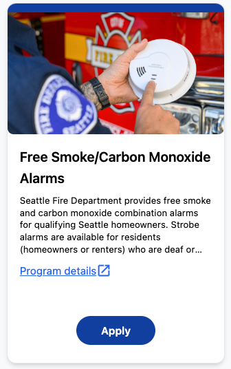
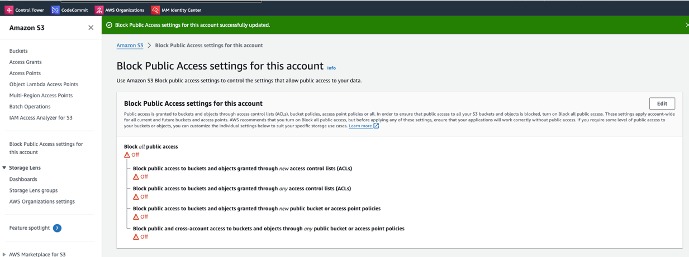
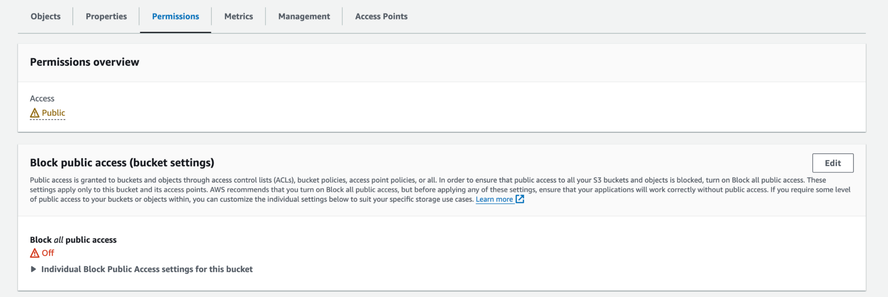

# Configure public storage

The program cards that we show on the CiviForm homepage can show an image to
help users more quickly scan all the available programs and see which programs
they might want to apply for.



These images are stored on your cloud storage provider and need to be publicly
viewable so that anyone visiting your CiviForm homepage can see them. This docs
page has directions for setting up public storage on your cloud storage provider
for these program images. 

These directions are currently only for AWS, because only AWS is supported at
the moment. When support for other cloud storage providers is added, we'll
update this page.

## Option 1: Use existing Terraform scripts

Our [terraform deploy system](https://docs.civiform.us/it-manual/sre-playbook/initial-deployment/terraform-deploy-system)
will automatically create a bucket called `{your-civiform-prefix}-public-files-s3`
and configure the bucket so that program images are publicly viewable. You still
need to be authenticated to *add* images to the bucket, but any images already
in the bucket are publicly visible.

If you already use our Terraform deploy system, you don't need to do anything
else! Program images should work automatically for you. CiviForm admins can
upload program images in the admin UI.

## Option 2: Manually create a public bucket

If you don't use our Terraform deploy system, you will need to manually create a
public bucket in AWS and configure it so that program images are publicly
viewable by anyone.

1. Create a bucket in S3. You could use the
`{your-civiform-prefix}-public-files-s3` name or a different name of your
choosing.

2. Set the `AWS_S3_PUBLIC_BUCKET_NAME` configuration variable to be the name of
the bucket you've created.

3. Change your AWS account settings to allow public buckets to exist. To do
this, open S3 in the AWS console, click "Block Public Access settings for this
account" in the left menu, and set it to "Off":

   

4. Change the bucket permissions to allow program images to be publicly viewable:

   - Open the bucket in S3.
   - Open the "Permissions" tab:
  
   

   - Manually edit the permissions to be the following
   
    ```json
   {
       "Version": "2012-10-17",
       "Statement": [
           {
               "Effect": "Allow",
               "Principal": {
                   "AWS": "arn:aws:iam::305584670637:role/{your-civiform-prefix}-ecs-task-execution-role"
               },
               "Action": "s3:*",
               "Resource": [
                   "arn:aws:s3:::{your-bucket-name}/*",
                   "arn:aws:s3:::{your-bucket-name}"
               ]
           },
           {
               "Effect": "Allow",
               "Principal": "*",
               "Action": "s3:GetObject",
               "Resource": "arn:aws:s3:::{your-bucket-name}/program-summary-image/program-*"
           }
       ]
   }
   ```

   Note that you'll have to change the items in `{ }` to be specific to your
   bucket and AWS setup. The key part of this permissions statement is the
   `"Action": "s3:GetObject"` with `"Effect": "Allow"` and `"Principal": "*"`:
   This says that any principal is allowed to see objects in the bucket.

For more information about public files in AWS, see these resources:
 - https://docs.aws.amazon.com/AmazonS3/latest/userguide/access-control-overview.html
 - https://docs.aws.amazon.com/AmazonS3/latest/userguide/example-bucket-policies.html
 - https://repost.aws/knowledge-center/read-access-objects-s3-bucket
