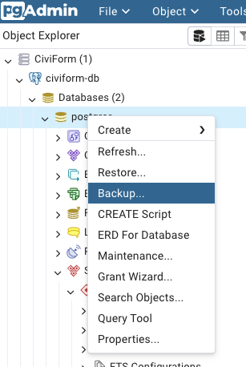
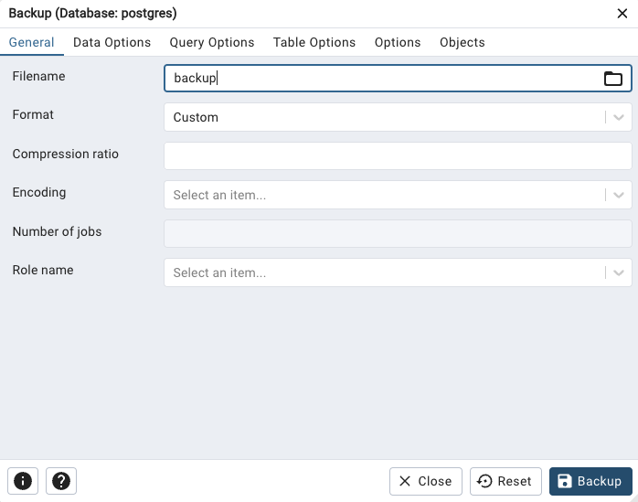
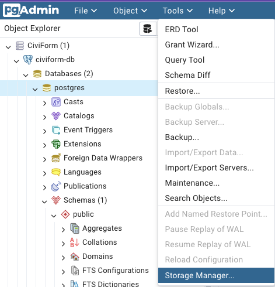
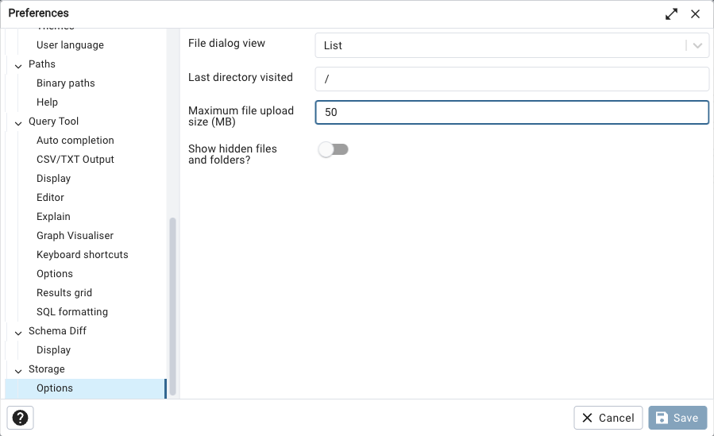
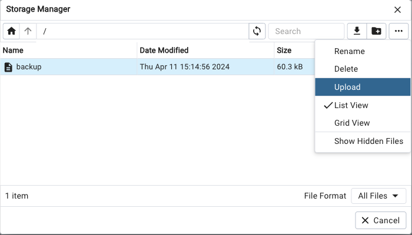
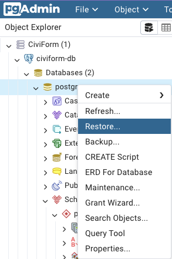
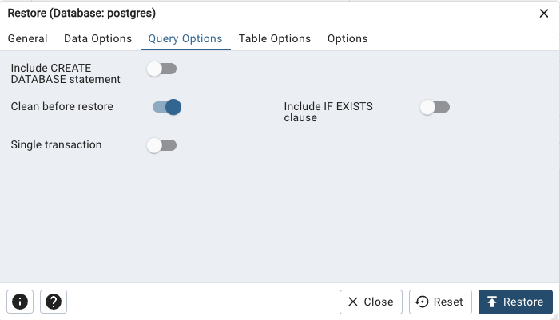

# Database Disaster Recovery

CiviForm's production database is backed up daily, with snapshot names prefixed with the value set by `POSTGRES_RESTORE_SNAPSHOT_IDENTIFIER`. By default they are retained for 7 days, which can be configured by`POSTGRES_BACKUP_RETENTION_DAYS`.

## (AWS) Restoring the database to a previous snapshot

In the event of catastrophic data loss or corruption, the production database can be restored to a previous
snapshot. To do this:

1. Identify the DB snapshot to restore to in the AWS console by navigating to RDS > Snapshots.
1. Copy the snapshot identifier (not the name, the identifier begins with `rds:`)
1. In your civiform_config.sh file, set `POSTGRES_RESTORE_SNAPSHOT_IDENTIFIER` to the identifier.
1. Remove deletion protection from the database by navigating to RDS > Databases, selecting your production database and removing deletion protection.
1. Run `bin/deploy`. You should see in the terraform plan that the RDS database will be replaced.

Note that once the database is restored, the `POSTGRES_RESTORE_SNAPSHOT_IDENTIFIER` should continue to reference
the same snapshot identifier. Changing the value of it will trigger another database replacement which may result
in data loss.

## Making a full backup of the database

As part of your backup strategy, you may want to dump the contents of the database outside of AWS in case something happens to your AWS account. There are a couple ways to do this.

### Option 1: Use the pgadmin UI

#### Backup

1. Follow the instructions to [access the database via pgadmin](https://docs.civiform.us/it-manual/sre-playbook/production-database-access#access-the-database-for-emergency-repair).
2. Right click the `postgres` database and choose `Backup`.

3. Pick any file name. All of the options can be left as default. Note that this saves the file locally inside the pgadmin container.

4. When complete, in the top menu bar, click `Tools -> Storage Manager`.

5. Choose the file you just created, then click the download button.

6. Save this file in a secure location.

#### Restore

1. If your backup file is larger than 50MB, go to `File -> Preferences -> Storage -> Options` and change the maximum file upload size appropriately.

2. In the top menu bar, click `Tools -> Storage Manager`.

3. Click the `Options` button and choose `Upload`, then upload your backup file.

4. Right click the `postgres` database and choose `Restore`.

5. Under Filename, choose the file you just uploaded. In the Query Options tab, select `Clean before restore`. Then click `Restore`.

6. Inspect the tables under `postgres -> Schemas -> Tables` to verify the data was restored properly.

