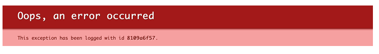

# Troubleshooting AWS deployments

## Outage, site is down

### DNS

**Symptoms**

- "This site can’t be reached" in Chrome
- Requests timing out

**Diagnose**

On a unix command line, run `dig <your CiviForm domain>`. (Note: Remove the protocol -- `http` or `https` -- from the front of your domain before running the command.) There should be a `CNAME` entry that points to an AWS
load balancer e.g. `seattle-civiform-lb-2038295446.us-west-1.elb.amazonaws.com.`

Confirm that the `CNAME` record matches the public domain for your AWS application load balancer by visiting
the AWS console EC2 > Load Balancing > Load Balancers and finding the load balancer for your prod deployment.

**Resolution**

If the `CNAME` entry is missing or does not match the DNS name you find in AWS, add or update a `CNAME` entry in your domain registrar with the application load balancer's DNS name.

### Server can't start

**Symptoms**

- "This site can’t be reached" in Chrome
- Requests timing out

**Diagnose**

View the ECS cluster for your prod deployment in AWS by going to ECS > Clusters and clicking the cluster for your production deployment. There should be at least one healthy task. If all tasks are unhealthy or unknown the server is unable to start.

If no tasks are healthy, view the server logs (see _Server errors_ below). Look for stack traces and error messages.

**Resolution**

If you have just deployed, revert your CiviForm version number to the previous version you deployed and [re-deploy](https://docs.civiform.us/it-manual/sre-playbook/upgrading-to-a-new-release).

Contact the CiviForm maintainers and include any errors you found in the server logs.

## Server errors

**Symptoms**

Server returns 400 or 500 level errors or pages with short, plaintext messages stating an error message.

**Resolution**

If you have deployed recently, consider reverting your CiviForm version number to the previous version you deployed and [re-deploying](https://docs.civiform.us/it-manual/sre-playbook/upgrading-to-a-new-release).

Investigate the server logs. Report any errors you find along with complete stack traces to the CiviForm maintainers. To view the server logs in the AWS console go to CloudWatch > Logs > Log groups, select the log group for your production deployment and view the combined log stream.

## Authentication errors

**Symptoms**

Users are unable to log in.

**Resolution**

Check with maintainers of the admin and applicant auth systems if there have been recent changes. Check the [release notes](https://github.com/civiform/civiform/releases/) for your CiviForm version to see if it mentions auth changes. If errors are occuring after the user successfully authenticates with the identity backend and redirects back to CiviForm there is likely a server error involved. Check server logs for errors.

Contact CiviForm maintainers with details of the investigation.

### Errors related to Authority ID

If a user has created an account as an applicant and then is added as an admin with the same email, they may see an error when logging in. When checking the logs, it'll show `Profile already contains an authority ID: Optional[iss:xxx] - which is different from the new authority ID: Optional[iss:yyy]`. To fix this error, the account admin will need to [access the database](https://docs.civiform.us/it-manual/sre-playbook/production-database-access#access-the-database-for-emergency-repair) and update the particular account to use the new authority ID. First, you can find the existing account by runnning `SELECT * FROM accounts where authority_id = 'iss:xxx'` (with the original authority_id). Once you confirm there is one account listed and it is the correct account (see note below), you then can run `UPDATE accounts SET authority_id = 'iss:yyy' WHERE authority_id = 'iss:xxx';`

NOTE: It should be strongly verified that the user/account is correct. Changing this without care is a security issue as now the "new" account has access to the system.

