# Manage program eligibility and visibility

*Note: Unless otherwise noted, assume that directions apply to both eligibility and visibility logic.*

## Eligibility

There are programs that may have strict criteria for eligibility. For example, if an Applicant’s date of birth is earlier than the qualifying year, they are ineligible for the program.

Using eligibility conditions, CiviForm Admins can screen applicants who don't meet the minimum requirements for a program early in the application process, as well as show applicants cases when there is a program they may qualify for, based on their previous answers.

## Visibility

CiviForm Admins may wish to hide or show certain screens in certain cases to better control program flow. For example, if an Applicant stated they have no dependents in their most recent taxes, they can skip the screen in which applicants provide information on dependents.

Using visibility conditions, CiviForm Admins can show or hide certain program screens for applicants, based on their answers to questions on previous screens.

## Adding new conditions

When viewing a screen in the program edit view, access to eligibility and visibility conditions are available at the "Add eligibility conditions" / "Add visibility conditions" buttons:

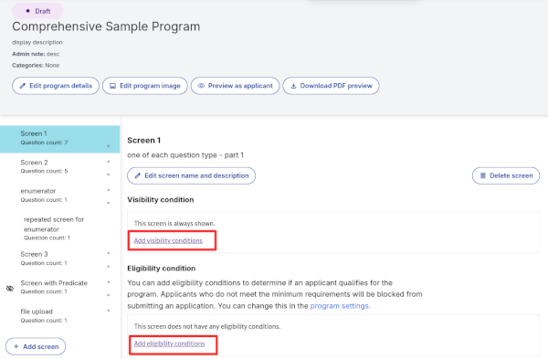

Clicking one of those will bring you to the edit view. You can add a new condition using the "Add Condition" button.

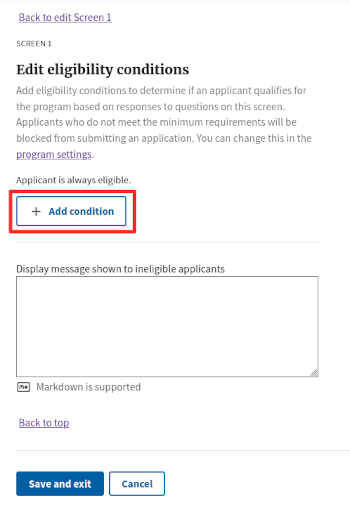

### A note on available questions

There may be no available questions to use within conditions. Invalid question types include: 

* File questions
* Enumerator questions. 

If there are no available questions to use, you may see an alert like the following:

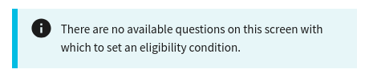

**Visibility conditions** take their questions from all previous program screens, so the alert will show as the following:

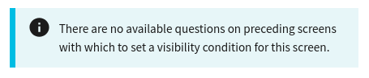

## Editing conditions

On adding a condition, you will be greeted with an empty condition block:

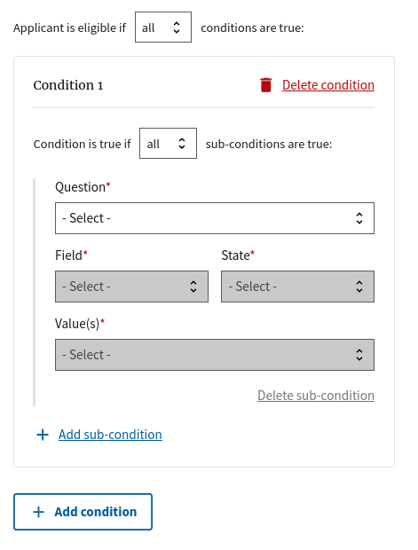

On selecting a question, you will be able to enter values and control the logical conditions. 

Admins can configure:
* **Question:** The question controlling the logic for this subcondition.
* **Field:** For question types with multiple pieces of data (e.g. "First Name", "Last Name"), which field is used for this subcondition.
* **State:** The logical operator for this subcondition (e.g. "Greater than", "Less than", "Equal to")
* **Value:** The value compared to the applicant's answer to this question, for eligibility and visibility decisions.

***Example:** The following applicant will be eligible if they are between the ages of 18 and 35.*

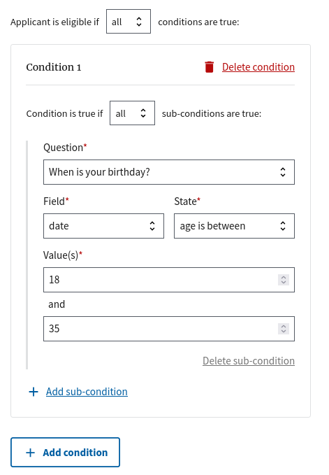

### Adding subconditions

You can add multiple *subconditions* within a condition using the "Add subcondition" button:

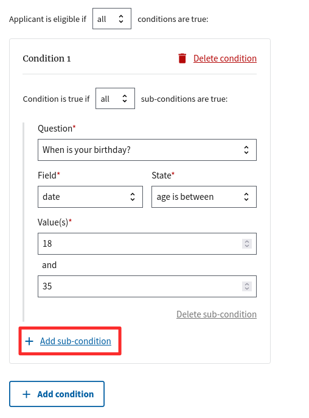

***Example:** The following applicant will be eligible if they are between the ages of 18 and 35 **AND** they think a scoop of ice cream should cost $1.*

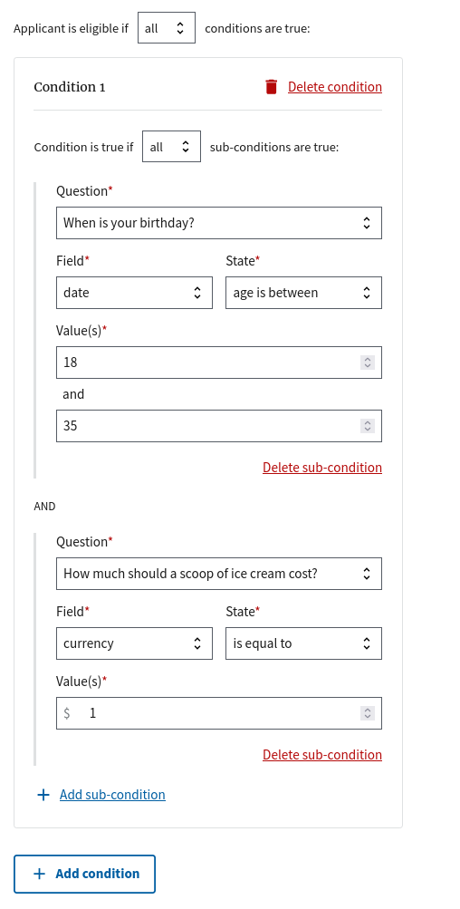

### Multiple conditions

Multiple conditions can be composed together for more complex logic.

***Example:** The following applicant will be eligible if (They are between the ages of 18 and 35 **AND** they think a scoop of ice cream should cost $1) **OR** They own a toaster.*

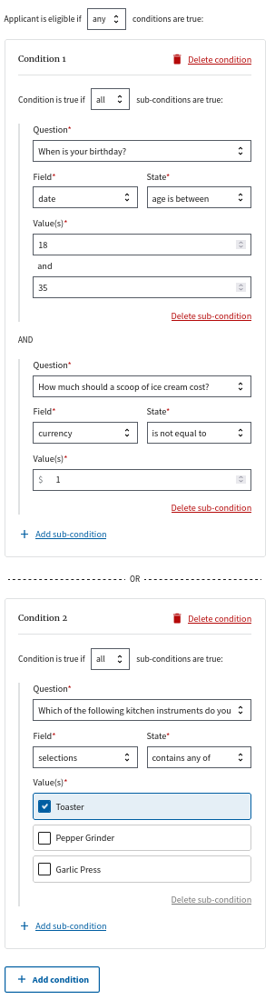

## Saving conditions

Clicking the "Save and Exit" button at the bottom of the edit page brings you back to the program view.

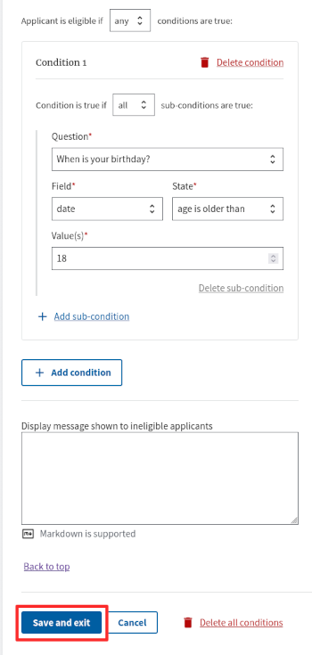

The program view will now display the conditions that you set:

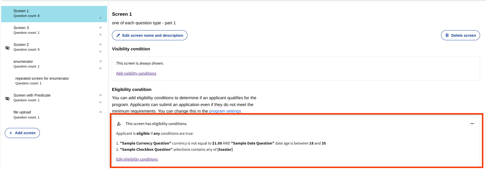

Clicking the "Edit eligibility conditions" button will return you to the edit view.

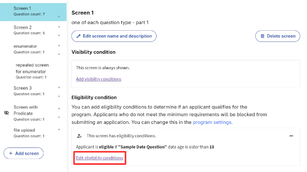

If a screen has *visibility conditions*, the program view will show an icon next to the screen title:

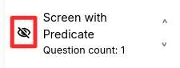

## Troubleshooting

### Unable to add new conditions

**Problem:** In the rare case of a CiviForm internal error, you may see the following alert:

**Possible causes and solutions:**
- **Endpoint failures:** This could be due to a transient issue. Save, wait for a few (3-5) minutes and retry. If issues persist, check your endpoint logs for any errors during CiviForm's attempts to add new conditions. 