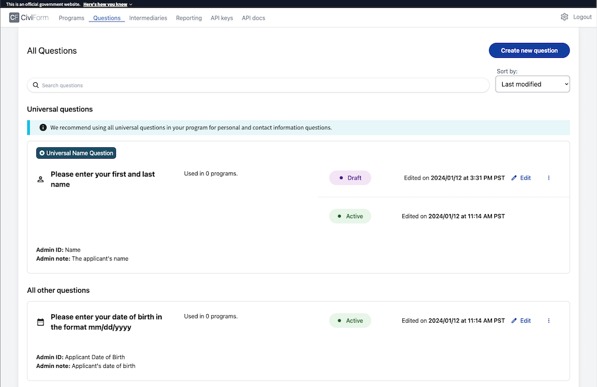

# Manage questions

Questions form the structure of a CiviForm program. When a CiviForm Admin creates a question for one of their forms, the question is saved in the global question bank. When programs reuse the same question, all Applicant data related to the question gets autofilled. This reduces duplicate data entry and ensures accuracy by using previously vetted information.

### Create a question
Watch the video or follow the step-by-step guide below.

 Create new questions in the shared question bank. 

1. Sign in to CiviForm as a CiviForm Admin.
2. Click **Questions** on the navigation bar.
3. Click **Create new question** and select a question type.\
   For more details on question types, go to [Question types](manage-questions.md#question-types).
4. Enter the information for the question.
5. Click **Create**.\
   The new question appears in the list of questions.

**Tip**: You might want to develop a naming convention for your questions. For example, address-residence, address-work, etc.

### Question Export Settings

When a CiviForm Admin creates a question, they must choose an export setting. The export setting controls whether data will be exported in the demography CSV, which is the CiviForm Admin's exported data. The export setting does not affect the Program Admin's exported data. The CiviForm Admin selects one of the following data export options:

**Don't include in demographic export** - the answer won't appear in any way in the exported data.

**Include in demographic export** - the raw answer as provided by the applicant will appear in the exported data.

**Obfuscate and include in demographic export** - the raw answer as provided by the applicant will not appear in the exported data, and instead, an "obfuscated" answer will appear. Obfuscated means that the applicant's answer to the question is cryptographically obscured, exporting text that is unique to the applicant's answer but does not reveal what the original text was. It is impossible to derive the applicant's original input from the resulting exported value. Only other questions with the exact same answer will have the same exported value. 

For example, in a social security number question, the following inputs would result in the corresponding outputs: 

Input: 123-45-6789 Example obfuscated output: d158596dd5a6cae6fcb282832885631553ecc8c8b0bf07f84c4aa691953cd0da 

Input: 123-45-6780 Example obfuscated output: 01ba4719c80b6fe911b091a7c05124b64eeece964e09c058ef8f9805daca546b

### Universal questions

Universal questions are questions that are intended to be used by all programs. When a question is marked as universal, it appears at the top in a separate section in the questions tab and the question bank. Any question may be set as a universal question.

On the programs tab, each program notes how many of the universal questions are used in the program. 

If a CiviForm Admin attempts to publish a program that does not contain all universal questions, a warning will be shown, but the program may be published anyway.

### Edit a question

You can edit both unpublished and published questions. To edit published questions, you need a new version. For more details on versioning, go to [Manage versions for programs & questions.](manage-versions-for-programs-and-questions.md)

1. Sign in to CiviForm as a CiviForm Admin.
2. Click **Questions** on the navigation bar and select a question.
3. Click **Edit draft**.
4. Modify the question information fields.
5. Click **Update**.

### Archive a question

If a question is no longer in use by any program, you can archive a question.

1. Sign in to CiviForm as a CiviForm Admin.
2. Click **Questions** on the navigation bar and select a question.
3. Click **Archive**.

### Restore an archived question

When you restore an archived question, you can use it in your programs. You can restore an archived question up until the next version is published. For more details on versioning, go to [Manage versions for programs & questions.](manage-versions-for-programs-and-questions.md)

1. Sign in to CiviForm as a CiviForm Admin.
2. Click **Questions** on the navigation bar and select an archived question.
3. Click **Restore archived**.

### Question types

You can customize your program to include multiple different question types. The table below shows the supported question types, along with the expected data input.

| **Type**     | **Use case and expected data**                                                                                                                                                                                                                                                                                                                                                                                                                                                                                                                                                                                                                                                                                                                                                                                                                                                                                                     |
| ------------ | ---------------------------------------------------------------------------------------------------------------------------------------------------------------------------------------------------------------------------------------------------------------------------------------------------------------------------------------------------------------------------------------------------------------------------------------------------------------------------------------------------------------------------------------------------------------------------------------------------------------------------------------------------------------------------------------------------------------------------------------------------------------------------------------------------------------------------------------------------------------------------------------------------------------------------------- |
| Address | An Applicant’s address. For example, residential, work, mailing, school, etc. |
| Currency | Currency questions are formatted with a decimal point (.) as a separator between the dollars and cents. Useful for asking income and debt-related questions (e.g. wages, benefits received, loan amounts, etc). |
| Checkbox | Useful when Applicants need to check multiple items to answer the question fully. <strong>Tip</strong>: If you want Applicants to select only one option from a group of options, use a Dropdown or Radio Button question instead. |
| Date | Suitable for capturing dates. For example, date of birth, graduation date, employment start date. |
| Dropdown | Useful for long lists (>8 items) of static data where a single selection is required. For example, a daycare program restricted to certain daycare sites. |
| Email | An Applicant’s email address. |
| Enumerator | Allows applicants to create a list of one type of entity. For example, household members, vehicles, jobs, etc. Enumerators do not store question data. Instead, the data is stored within the repeated questions within the enumerator. Enumerators also allow you to dynamically add multiple questions whenever needed, reducing program clutter. For example, you can create a repeater to ask the same questions for every member of an Applicant’s household. Enumerator questions must be the only question in an enumerator screen. For more details, go to <a href="using-enumerator-questions-and-screens-in-a-program.md">Using enumerator questions &#x26; screens in a program.</a> |
| File Upload | Allows Applicants to upload files to support their application. For example, PDF files and images (PNG, JPG, GIF). File Upload questions must be the only question in a screen. |
| ID | Useful for requesting identification or account numbers. For example, a resident's utility account number. Only numeric numbers are allowed. The minimum and maximum length for this field can be defined in the question settings. |
| Name | A full, legal name. |
| Number | Applicants can enter a numeric value. For example, annual household income. Numbers must be integers only with no decimals allowed. Users can increase or decrease the number using the arrow buttons within the field. |
| Radio Button | Suitable for a short list (&#x3C;=7 items) of static items where the Applicant is required to select only one option. For example, simple yes/no questions or employment status. <strong>Tip</strong>: If you want Applicants to select multiple options in a question, use a Checkbox question instead. |
| Static Text | A free form field that includes the ability to fully format text using Markdown. See <a href="using-markdown.md">Using Markdown</a> for more information. |
| Text | A free form field that can store letters, numbers, characters, or symbols. |
| Phone | Accepts two inputs from the user: the country, and the number. The number is a formatted input in the (xxx) xxx-xxxx format. Currently, it supports only US and Canadian numbers. The phone numbers are validated and stored as strings. When the admin views the entered number, they see it in the +1 xxx-xxx-xxxx format. |
