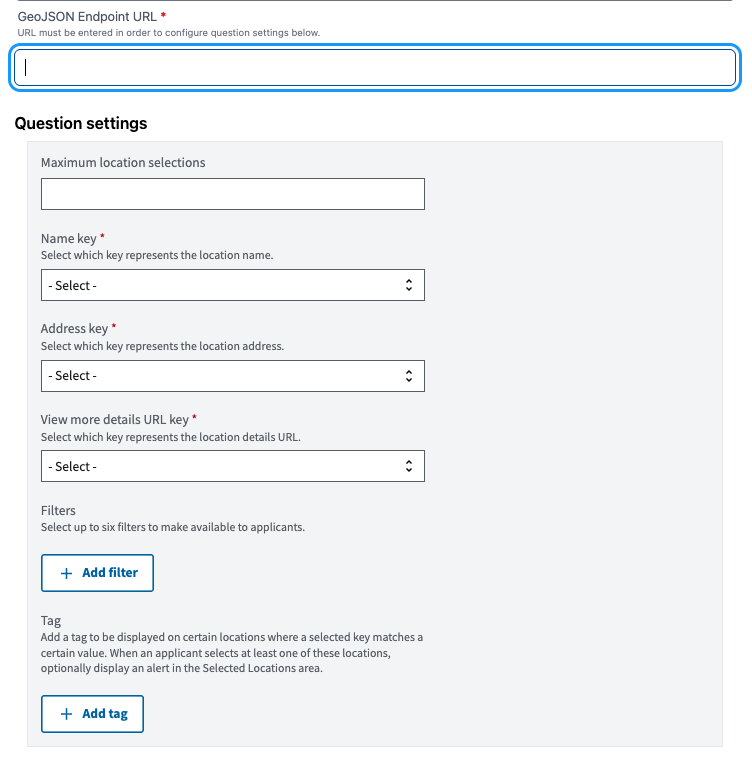
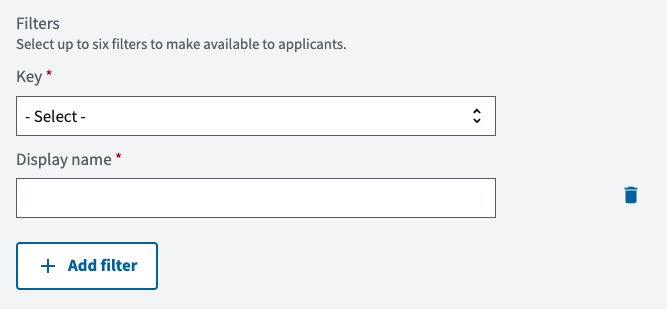
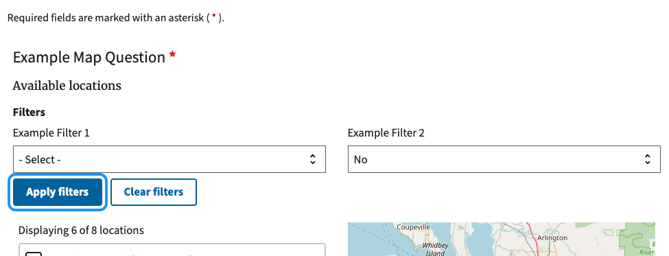
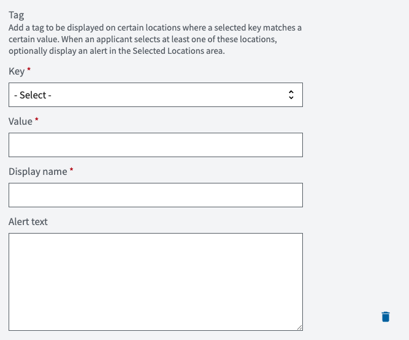
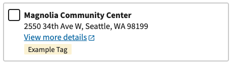

# Map questions

Map questions allow applicants to view and select locations on an interactive map. This section covers the detailed setup and configuration options for map questions.

## Setup requirements

1. A publicly accessible HTTP endpoint that provides location data in the GeoJson format
2. Valid [GeoJSON](https://datatracker.ietf.org/doc/html/rfc7946) data containing Features with:
   - Unique identifiers (the Feature ID)
   - Point geometry only (longitude and latitude coordinates)
   - Properties must include fields for:
     - Display name of the location
     - Physical address of the location
     - URL linking to more information about the location
   
   When setting up the GeoJSON, you may use any name for the individual fields. Later, when configuring the map question, CiviForm Admins will be able to specify which GeoJSON property fields contain the required information.

#### Sample GeoJSON
```json
{
  "type": "FeatureCollection",
  "features":
    [
      {
        "type": "Feature",
        "geometry": {
          "type": "Point",
          "coordinates": [-122.4194, 37.7749]
        },
        "properties": {
          "facility_name": "Main Community Center",
          "location": "123 Main St, San Francisco, CA",
          "more_info_link": "https://example.com/center",
          "wheelchair_accessible": true,
          "capacity": "limited"
        },
        "id": "main-community-center" # Feature ID
      },
      {
        ...
      },
      {
        ...
      }
    ]
}

```

## Configuration options

When creating a map question, admins must configure:

1. **GeoJSON Endpoint URL**
1. **GeoJSON Key Mappings**:
   - **Name key**: Specify which GeoJSON property contains the location's name (e.g., "facility_name", "location_title")
   - **Address key**: Specify which property contains the location's address (e.g., "street_address", "location")
   - **View more details URL key**: Specify which property contains the URL for more details (e.g., "more_info_link", "website")



Admins can also configure:

- **Maximum selections**: Limit how many locations an applicant can choose
- **Filters**: [Add filters](#adding-a-filter) based on specific GeoJSON property keys to help applicants find relevant locations
- **Tag**: [Configure a tag](#adding-a-tag) that displays on locations with specific property values

For example, if you were using the [sample GeoJSON feature](#sample-geojson)

You would:
1. Select `facility_name` as the name key field
2. Select `location` as the address key field
3. Select `more_info_link` as the view more details URL field
4. Optionally [add a filter](#adding-a-filter) for `wheelchair_accessible`
5. Optionally [add a tag](#adding-a-tag) for locations where `capacity` equals "limited"

## Adding a filter

Filters help applicants narrow down location options based on specific criteria. When you add a filter, applicants will see a dropdown or checkbox interface to filter locations by the values in a specific GeoJSON property. Up to six filters can be added to each map question.

To add a filter:

1. Click **Add filter** when configuring the map question
2. Select the **Key** that contains the filter values (e.g., "wheelchair_accessible", "service_type", "language_support")
3. Enter a **Display name** for the filter



**How filters work for applicants:**
- CiviForm automatically detects all possible values for the specified property across all locations in the GeoJSON data
- Applicants see these values as filter options in the interface



**Best practices:**
- Use property keys with a limited number of distinct values (e.g., boolean values, categories)
- Avoid using properties with unique values for each location (e.g., phone numbers, specific addresses)
- Ensure the property exists on all or most locations in your GeoJSON data

## Adding a tag

A tag displays on locations with a specific property value. Optionally, an alert for that tag displays to applicants when they select a location with that specific property value. This is useful for notifying applicants about special conditions, requirements, or limitations.

To add a tag:

1. Click **Add tag** when configuring the map question
2. Select the **Key** for CiviForm to monitor (e.g., "capacity", "status", "requires_appointment")
3. Enter the **Value** that triggers the tag (e.g., "limited", "closed", "true")
4. Enter a **Display name** that displays as the tag on a location
4. Optionally, write an **alert message** that will be displayed to applicants that select those locations



**How tags work for applicants:**
- When an applicant selects a location on the map, CiviForm checks if the tag condition is met
- If the selected location has a property that matches the configured key-value pair, the alert message is displayed
- The tag is informational and does not prevent applicants from selecting the location




**Best practices:**
- Keep alert messages clear and concise
- Consider what actions you want applicants to take after seeing the alert
- Test the alert with your actual GeoJSON data to ensure it triggers correctly

## Data storage and refresh settings

CiviForm stores all the data provided by the GeoJSON endpoint (see [sample GeoJSON](#sample-geojson)). When an applicant makes a selection, CiviForm stores:
- The unique identifier of the selected location provided as the Feature ID in the GeoJSON data
- The value of the configured name field at the time of selection

Note: It is the admin's responsibility to maintain a record of which location corresponds to each Feature ID, as CiviForm only returns these two pieces of information.

By default, the stored data won't be automatically updated. To enable automatic data refresh:

1. Set `durable_jobs.map_refresh=true` in your application configuration
2. Once enabled, CiviForm will ping the GeoJSON endpoint every 10 minutes to refresh the data. If the endpoint fails at any point, the data will not be updated and CiviForm will continue to use data from a previous successful call until it is able to successfully refresh the data.

This automatic refresh is useful for locations with frequently changing properties (e.g., availability, capacity, or service hours).

## Validation options

The map question supports:
- Required vs optional selection
- Maximum number of selections

## Accessibility considerations

To ensure map questions are accessible to all users:
- Ensure location names are clear
- Include several filters so that applicants can narrow down the list of locations
