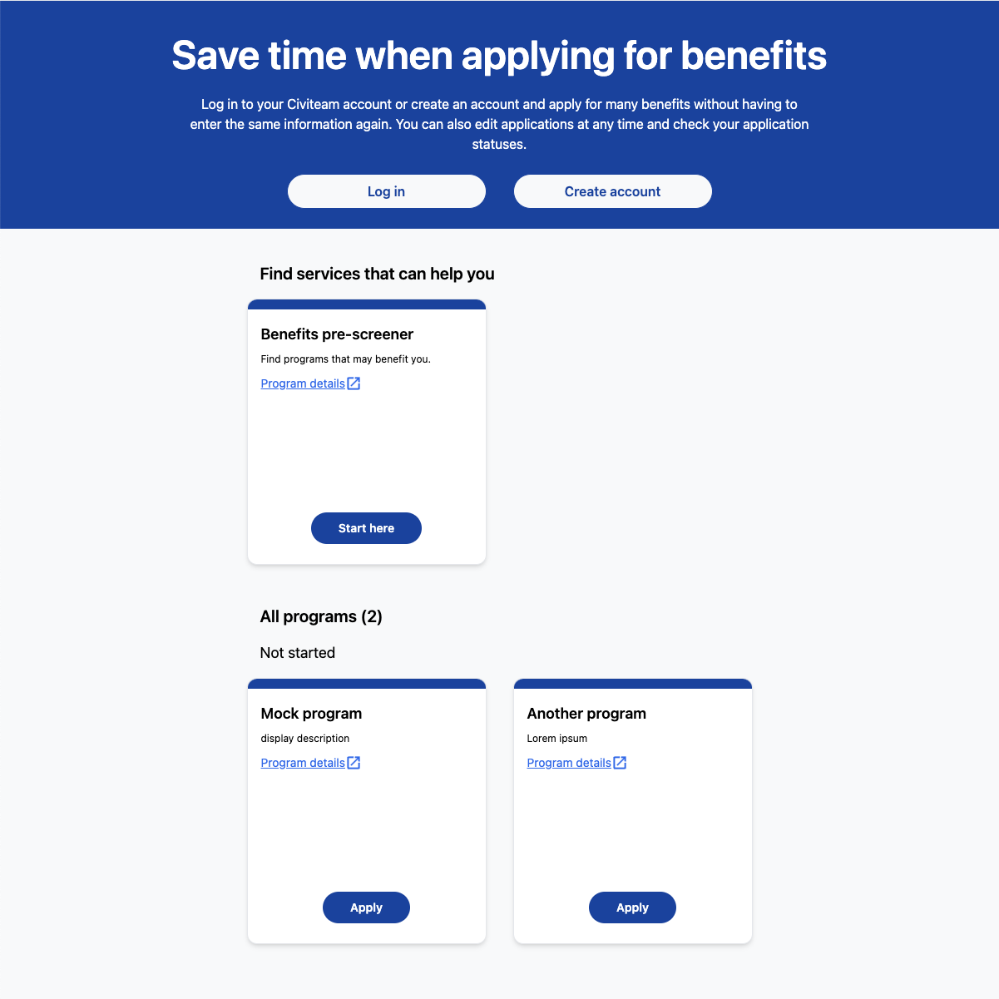

# Set a program as the pre-screener

You can mark one program as the pre-screener (aka intake form). The pre-screener is pinned to the top of the programs page for applicants in a special **Find benefits** section. When the applicant fills out the pre-screener, programs they may be eligible for are displayed to them based on their answers. For that reason, you may want to use the pre-screener feature in combination with the eligibility feature.

## Creating a program and marking it as the pre-screener

1. Sign in to CiviForm as a CiviForm admin.
1. Click **Programs** on the navigation bar.
1. Click **Create a new program**.
1. Fill out all of the program details and check the **Set program as pre-screener** checkbox.
1. Add questions to the pre-screener as normal.

## Marking an existing program as the pre-screener

1. Sign in to CiviForm as a CiviForm admin.
1. Click **Programs** on the navigation bar.
1. Click **Edit** for the program you would like to set as the pre-screener.
1. Click **Edit program details**.
1. Check the **Set program as pre-screener** checkbox.

Note that eligibility conditions cannot be set for the pre-screener, so if you had already created eligibility conditions for this program, they will be removed.

## Viewing which program is the pre-screener

1. Sign in to CiviForm as a CiviForm admin or Program admin.
1. Click **Programs** on the navigation bar.
1. The pre-screener will be labeled. If no program has the pre-screener label, there is no pre-screener currently set.

## Using eligibility conditions in combination with the pre-screener.

When the applicant fills out the pre-screener, programs they may be eligible for are displayed to them based on their answers. To make the most use out of this feature, set [eligibility conditions](https://docs.civiform.us/user-manual/civiform-admin-guide/manage-eligibility) on the programs using questions that appear on both the pre-screener and the target program. For example, you may create a pre-screener with a question asking applicants for their date of birth. You may have program A that requires applicants to be 18 or over and program B that requires candidates to be under the age of 18. Go to program A and set an eligibility condition specifying that the applicant is eligible if 18 or over. Set the eligibility condition for program B to under 18. Then when the applicant fills out the pre-screener, either program A or B will be recommended to them based on their answer to the date of birth question.
