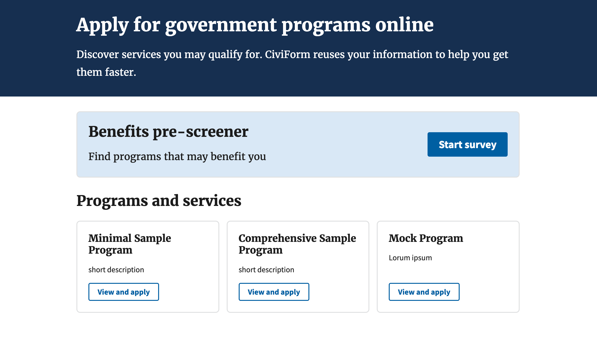

# Set a program as the pre-screener

You can mark one program as the pre-screener (aka intake form). The pre-screener is pinned to the top of the programs page for applicants in a special **Find services** section. After the applicant submits the pre-screener, programs they may be eligible for are displayed to them based on their answers. For that reason, you may want to use the pre-screener feature in combination with specifying eligibility conditions on non-pre-screener programs.



## Using eligibility conditions in combination with the pre-screener

When the applicant fills out the pre-screener, programs they may be eligible for are displayed to them based on their answers. To make the most use out of this feature, set [eligibility conditions](https://docs.civiform.us/user-manual/civiform-admin-guide/manage-eligibility) on the programs using questions that appear on both the pre-screener and the target program.

For example, you may create a pre-screener with a question asking applicants for their date of birth. You may have program A that requires applicants to be at least 18 years old and program B that requires candidates to be under 18. Set an eligibility condition for program A specifying that the applicant is eligible if 18 or over. Set the eligibility condition for program B to under 18. Then when the applicant fills out the pre-screener, either program A or B will be recommended to them based on their answer to the date of birth question.

## Creating a program and marking it as the pre-screener

1. Sign in to CiviForm as a CiviForm admin.
1. Click **Programs** on the navigation bar.
1. Click **Create a new program**.
1. Fill out all of the program details and check the **Set program as pre-screener** checkbox.
1. Add questions to the pre-screener as normal.

## Marking an existing program as the pre-screener

1. Sign in to CiviForm as a CiviForm admin.
1. Click **Programs** on the navigation bar.
1. Click **Edit** for the program you would like to set as the pre-screener.
1. Click **Edit program details**.
1. Check the **Set program as pre-screener** checkbox.

Note that eligibility conditions cannot be set for the pre-screener, so if you had already created eligibility conditions for this program, they will be removed.

## Viewing which program is the pre-screener

1. Sign in to CiviForm as a CiviForm admin or Program admin.
1. Click **Programs** on the navigation bar.
1. The pre-screener will be labeled. If no program has the pre-screener label, there is no pre-screener currently set.

## Setting a redirect URL for when no eligible programs are found
If the applicant fills out the pre-screener and no programs they may be eligible for are found, we display a message to them that contains a link to the civic entity's website where they can find more benefit programs. The message says:

***The pre-screener could not find programs you may qualify for at this time. However, you may apply for benefits at any time, by clicking 'Apply to programs'. Or to view additional benefit programs you can visit `CIVIC_ENTITY_WEBSITE`***

To set the text and URL that are used for `CIVIC_ENTITY_WEBSITE`, you need to set the following [environment variables](https://docs.civiform.us/it-manual/sre-playbook/server-environment-variables) in your deployment script:
* ```COMMON_INTAKE_MORE_RESOURCES_LINK_TEXT```
* ```COMMON_INTAKE_MORE_RESOURCES_LINK_HREF```
