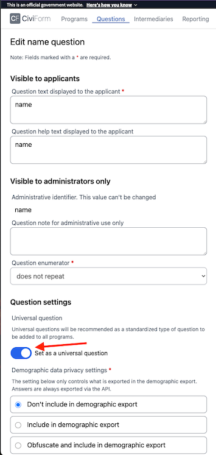
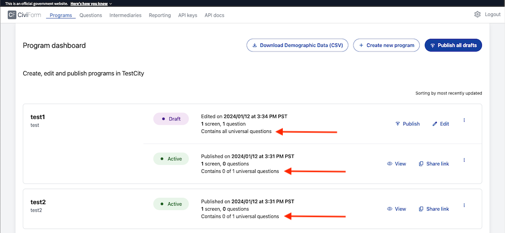
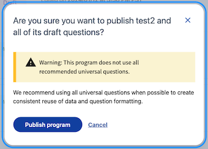
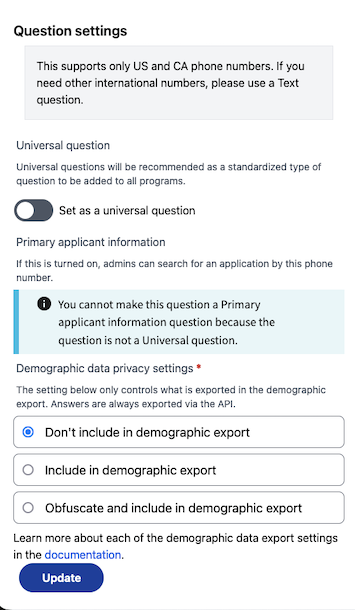

# Universal and Personal Applicant Information questions

### Universal questions

Universal questions are questions that are intended to be used by all programs. When a question is marked as universal, it appears at the top in a separate section in the questions tab and in the questions list sidebar when creating a program. Any question may be set as a universal question.

When creating or editing a question, select the following toggle to make the question universal.

It then shows up in the questions tab, as well as the questions list sidebar.

On the programs tab, each program notes how many of the universal questions are used in the program. 

If a CiviForm Admin attempts to publish a program that does not contain all universal questions, a warning will be shown, but the program may be published anyway.

### Primary Applicant Information questions

Primary Applicant Information (PAI) questions are a subset of Universal questions that allow the system to take actions based on the answers an applicant gives to those questions, whether or not the user is logged in. There are currently four types of questions that may be marked as PAI questions and have specific actions associated with them:
- Name questions
- Email questions
- Phone number questions
- Date questions (should only be used for date of birth questions)


**Note** A question MUST be marked as a Universal question before it can be marked as a PAI question. Only one instance of a question type may be marked as the PAI question for that question type at a time.


When an applicant answers a question marked as a PAI question, specific actions may taken using their answer. The current system actions that are available are:
- Searching applications by name, email, and phone number
- Emailing guest users status updates about their applications
- Pre-populating applications with information entered when a Trusted Intermediary (TI) creates a client
- Updating TI client information based on answers to application questions

For questions that may be marked as PAI questions, you will see an additional section appear when you toggle the "Set as a universal question" toggle. The "Primary application information" section that appears will describe what system actions apply for this question type, and will allow you to set the question as the PAI question for this question type.

Before:

After:

