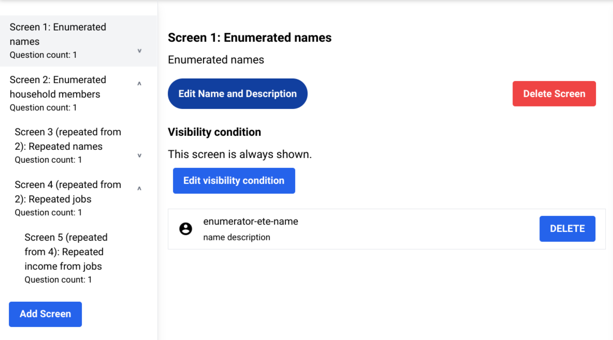

# Using enumerator questions & screens in a program

CiviForm contains the enumerator question type that offers CiviForm Admins a specialized way of structuring their data. Repeated questions can be created for enumerator questions, which allows admins to ask the same question for each repeated entity the applicant lists for the enumerator question.

An enumerator screen allows you to create repeated screens with repeated questions in them. In an enumerator screen, the applicant provides a list of repeated entities (for example, household members). Applicants can view each repeated screen for each repeated entity declared in the enumerator screen.

For example, if a program needs to gather name and date of birth information for each of an applicant's children. You can create an enumerator screen with an enumerator question to list the applicant's children, and a repeated screen with the repeated questions for the name and date of birth. You can choose to put both the name and date of birth repeated questions in the same repeated screen, or create two repeated screens with one question in each screen.

Enumerators do not store question data. Instead, each repeated question of the enumerator stores the data. An Applicant's answers to enumerator questions are only used to help Applicants track their answers within the repeated questions.

A screen can only contain an enumerator when it’s the only question on the screen. Repeated screens are created from enumerator screens. An enumerator screen can be a repeated screen of another enumerator. An enumerator screen's repeated screen appears below the enumerator screen and is indented in the tree. Repeated screens display a label showing the screen they were copied from. When adding repeated screens, the enumerator question in the enumerator screen isn’t copied to the repeated screens.

### Create an enumerator question

1. Sign in to CiviForm as a CiviForm Admin.
2. Click **Questions** on the navigation bar.
3. Click **Create new question** and select **Enumerator**.
4.  Enter the information for the question. See table below for the enumerator question fields, along with the expected data input:

    | **Field**           | **Expected data**                                                                                                                                                                                   |
    | ------------------- | --------------------------------------------------------------------------------------------------------------------------------------------------------------------------------------------------- |
    | Question text       | 
The text displayed to the Applicant.

For nested enumerators, the “$this” token is required.
                                                                                            |
    | Question help text  | 
The help text displayed to the Applicant.

If the question help text field is used, the “$this” token may be used for nested enumerators.
                                               |
    | Question enumerator | Can be set to “does not repeat” or to another enumerator when using nested enumerators.                                                                                                             |
    | Question settings   | 
Entity type: The repeated entity type that’s being enumerated. This should be a singular noun, not plural. For example, “Household member”, <em>not</em> “Household members”.

Minimum entity count: The minimum number of answers the applicant must provide.

Maximum entity count: The maximum number of answers the applicant may provide.
  |
6. Click **Create**.\
   The new question appears in the list of questions.

### Create a repeated question

Any question type can be a repeated question, including the enumerator type.

1. Sign in to CiviForm as a CiviForm Admin.
2. Click **Questions** on the navigation bar.
3. Click **Create new question** and select the question type you want to use.
4.  Enter the information for the question. See table below for the repeated question fields, along with the expected data input:

    | **Field**           | **Expected data**                                                                                                                                                                                                                                                                                                                                                                                                                                                                                                                                                               |
    | ------------------- | ------------------------------------------------------------------------------------------------------------------------------------------------------------------------------------------------------------------------------------------------------------------------------------------------------------------------------------------------------------------------------------------------------------------------------------------------------------------------------------------------------------------------------------------------------------------------------- |
    | Question text       | 
Enter the “$this” token to refer to the name of the repeated entity the Applicant will provide. For example, “Monthly income for $this”, or “$this’s monthly income”. The token appears as highlighted in the preview pane.

For nested repeated questions, you can use “$this.parent” to refer to a higher-level repeated entity. For example, if the top-level enumerator is household members and the current enumerator is household member jobs, “Monthly income for $this.parent from $this” would be something like “Monthly income for Theresa from Hooli”.
 |
    | Question help text  | (Optional) If the question help text field is used, the “$this” token may be used.                                                                                                                                                                                                                                                                                                                                                                                                                                                                                              |
    | Question enumerator | Select the enumerator this question should be a repeated question for.                                                                                                                                                                                                                                                                                                                                                                                                                                                                                                          |

6. Click **Create**.\
   The new repeated question appears in the list of questions.

### Add an enumerator question to an enumerator screen

1. Sign in to CiviForm as a CiviForm Admin.
2. Click **Programs** on the navigation bar and select a program.
3. Click **Edit** > **Manage questions**.
4. Select an existing screen with no other questions (since a screen can only contain an enumerator when it’s the only question in the screen) or click **Add screen**.
5. Add an enumerator question to the screen by selecting it from the question bank.\
   The question appears within the screen and the “Create repeated screen” button is visible.
6. (Optional) To modify a screen’s name and description, click **Edit name and description**.

### Add a repeated question to a repeated screen

1. Sign in to CiviForm as a CiviForm Admin.
2. Click **Programs** on the navigation bar and select a program.
3. Click **Edit** > **Manage questions**.
4. Locate an enumerator screen.
5. Click **Create repeated screen**.\
   The screen appears at the bottom of the repeated screens list for the enumerator screen.
6. Add a repeated question to the screen by selecting it from the question bank.\
   The question bank shows only the questions you can add to a screen, so if there are no questions available that means you need to create repeated questions. The question then appears within the screen.
7. (Optional) To modify a screen’s name and description, click **Edit name and description**.

***

| 
IMPORTANT: You can only remove an enumerator question if there are no repeated screens. Similarly, you cannot delete an enumerator screen if there are repeated screens.
 |
| ---------------------------------------------------------------------------------------------------------------------------------------------------------------------------------- |

### Remove an enumerator from a screen

1. Sign in to CiviForm as a CiviForm Admin.
2. Click **Programs** on the navigation bar and select a program.
3. Click **Edit** > **Manage questions**.
4. Find the enumerator question within a screen you want to remove and select it.\
   The question is removed from the screen and it returns to the question bank. The “Create repeated screen” button is also removed.

### Remove a repeated screen

1. Sign in to CiviForm as a CiviForm Admin.
2. Click **Programs** on the navigation bar and select a program.
3. Click **Edit** > **Manage questions**.
4. Find the repeated screen you want to remove and click **Delete screen**.\
   The screen is removed from the program.

***

### Example: Use Enumerator Question to Collect Household Information

Suppose you have a section on a program application form where applicants need to provide information about their household members.

**List of Household Members** 
> | **Name**  |    **Birth Date**  | **Relationship** | **Employment Status**  |
> |-----------|--------------------|------------------|------------------------|
> |           |                    |                  |                        |
> |           |                    |                  |                        |
> |           |                    |                  |                        |

   Example valid values: \
   Relationship: "Head of Household", "Spouse", "Child", "Parent"  
   Employment Status: "Employed", "Unemployed", "Retired", "Student"

---

#### Steps to Collect Household Information

##### Step 1: Create an Enumerator Question
1. Go to the **Questions** tab and click "Create new question".
2. Select **"Enumerator"** as the question type.
3. Fill in the details:
> | **Field** |    **Value**  | 
> |-----------|--------------------|
> |Question text   | `List all members of your household`                |
> |Question help text           |     Add any helpful text for the applicant               |
> |Administrative identifier           | `household_members`                   |
> |Question enumerator           |Set to `does not repeat` since this is the top-level enumerator |
> |Question settings - Repeated entity type| 
 `Household member` 
This is the logical description of the repeated entity or the name that will appear when applicants add entities to or remove entities from the enumerator question. For example, setting this field to 'household member' would show: “add household member”, “remove household member”, “name of household member”, etc, on subsequent screens. |

4. Click **Create**.

---

##### Step 2: Create Repeated Questions
Now, create the repeated questions for each piece of information you want to collect about each entity (in this case, `household member`). For this example, we'll create repeated questions for:

**Name**:
1. Create a new question of type **"Name"**.
2. Fill in the details:
   - **Question text**: `What is $this's full legal name?`.  (The **$this** token refers to the household member listed by the applicant.)

   - **Administrative identifier**: `household_member_name`
   - **Question enumerator**: `household_members` (This is the Administrative identifier of the Enumerator Question created in the previous step.) 

3. Click **Create**.

**Birth Date**:
1. Create a new question of type **"Date"**.
2. Fill in the details:
   - **Question text**: `What is $this's date of birth?`
   - **Administrative identifier**: `household_member_birthdate`
   - **Question enumerator**: `household_members`
3. Click **Create**.

   Tip:  By asking for the date of birth and not age directly,  we can calculate the age, and the benefit is  that the value of age is only valid at a specific point of time and becomes stale as time goes on, whereas a person's date of birth stays valid. This also makes for a slightly shorter application for the applicants as opposed to asking both questions. 

**Relationship**:
1. Create a new question of type **"Dropdown"**.
2. Fill in the details:
   - **Question text**: `What is $this's relationship to the applicant?`
   - **Administrative identifier**: `household_member_relationship`
   - **Dropdown options**: "Head of Household", "Spouse", "Child", "Parent"
   - **Question enumerator**: `household_members`
3. Click **Create**.

**Employment Status**:
1. Create a new question of type **"Radio Button"**.
2. Fill in the details:
   - **Question text**: `What is $this's employment status?`
   - **Administrative identifier**: `household_member_employment_status`
   - **Radio button options**: "Employed", "Unemployed", "Retired", "Student"
   - **Question enumerator**: `household_members`
3. Click **Create**.

---

##### Step 3: Add Enumerator and Repeated Questions to Screens
1. Go to the **Programs** tab and select the program you're working on.
2. Click **Edit**.
3. Create a new screen or select an existing screen with no other questions.
   - A screen can only have an enumerator question if it is the only question on the screen.
4. Add the enumerator question (`List all members of your household`) to this screen from the question bank.
5. Click **Create repeated screen** to create a repeated screen associated with the enumerator screen.
   - **Screen name**: `Household member details`
   - **Screen description**: "Please add each household member's name, birth date, relationship, and employment status."
6. Click "Add question" to the repeated questions for name, age, relationship, and employment status to the repeated screen.

---

##### Step 4: Configure and Publish
1. Modify screen names and descriptions as needed.
2. Save your changes.
3. Publish your draft program to make it available to applicants.

---

Now, when applicants fill out this program:
1. They will first be asked to list all household members.
2. For each member listed, they will be presented with repeated questions to provide:
   - Name
   - Date of birth
   - Relationship
   - Employment status

This allows you to collect comprehensive household information in a structured manner.
