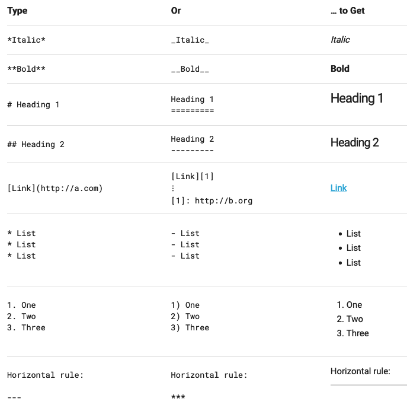

# Using Markdown

Markdown is a simple formatting tool that allows you to create text links and lists as well as apply bold, italics, font sizes, and other formatting edits to text. CiviForm Admin can use Markdown to format text in four key places within CiviForm:
- Program descriptions
- Custom confirmation screen messages
- Static question text
- Regular question text (Note: For regular question text, please limit formatting to bold, italics and text links only. Changing font size or making other edits that alter the flow of text can make question text hard to read)

The formatting options currently supported by CiviForm are outlined in the table below along with how to use them. If you would like a formatting option that we do not currently support, let us know!

## Notes and Caveats about working with Markdown in CiviForm
### Font Size
Header syntax can be used to change font size. We currently support three font sizes - large, regular, and small. Starting a line with `#` or `##` will create an "h2" size header, which is the largest text possible. Using 3 (`###`) or 4 (`####`) hashes will result in regular sized text. Using 5 (`#####`) or 6 hashes (`######`) will result in the smallest text.

Accessibility Note: Generally, more hashes indicates less important text. Folks who are visually impaired often rely on the header tag to let them know the relative importance of text on the page since they might not be able to see differences in font size.

### URLs
Urls that start with `http://` or `https://` will be automatically detected as links and have the appropriate formatting applied. Urls that do NOT start with `http://` or `https://` will not be detected as links. All links are set to automatically link out to a new page.

Urls used within text links must also include `http://` or `https://` to link out correctly. Examples:\
Correct: `[This link will work!](https://www.example.com)`\
Incorrect:  `[This link will not work](www.example.com)`

